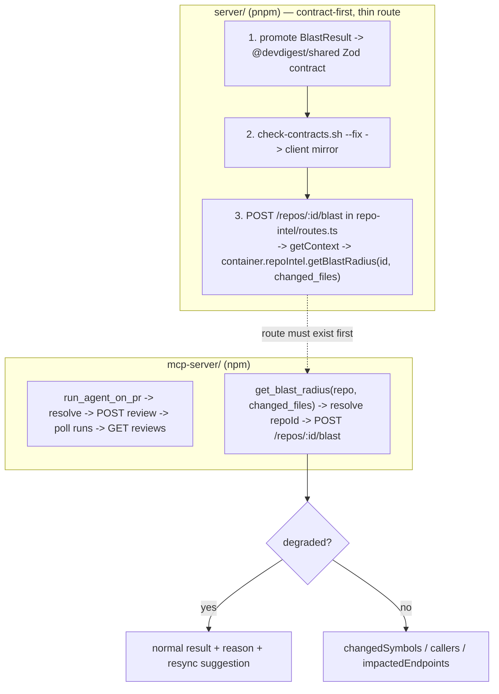

# mcp-server — Development Plan (L04)

Status: approved, ready for implementation. This is the single source of truth
for this package's build — if a future summary or agent transcript disagrees
with this file, this file wins.

Package name is deliberately `mcp-server`, not `devdigest-mcp` (the name used
in root `README.md`'s L04 roadmap line). This is a chosen deviation, not an
oversight.

## Objective

A standalone, local-only MCP server exposing exactly 5 tools over stdio
transport (`@modelcontextprotocol/sdk`), talking to the already-running
DevDigest Fastify API (`http://localhost:3001`) as a black-box JSON HTTP
client — plus a new real HTTP route on `server/` so `get_blast_radius` is not
a stub.

"Done" means: the 5 tools register/validate via the SDK; `run_agent_on_pr`
performs create+wait+fetch as one call; `get_blast_radius` calls a real
`POST /repos/:id/blast` route and passes through `degraded`/`reason`; the new
server route, promoted Zod contract, CI workflow, and routing/doc housekeeping
all land in the correct order.

## Scope

- **`server/`** (touched) — new route in the existing
  `src/modules/repo-intel/routes.ts`; promote `BlastResult` (and friends) to
  Zod contracts in `src/vendor/shared/contracts/`. No service/repository
  logic changes — `getBlastRadius()` already exists
  (`repo-intel/service.ts:220-304`).
- **`client/`** (touched, mechanical only) — contract sync via
  `./scripts/check-contracts.sh --fix`. No feature consumption.
- **`mcp-server/`** (new package) — 5 tools, HTTP client, resolvers,
  run-poller, stdio bootstrap.
- **Repo root** (touched) — `CLAUDE.md`/`AGENTS.md` tables,
  `.github/workflows/mcp-server.yml`, `.claude/skills/pr-self-review/routing.md`.
- Not touched: `reviewer-core/`, `e2e/`.

## Confirmed decisions (do not re-litigate)

| Decision | Value |
|---|---|
| Package name | `mcp-server` |
| Integration | HTTP to running server API, no direct `server/src` import, no `@devdigest/shared` import (own independent Zod schemas) |
| Auth | None — server has no auth middleware; `LocalNoAuthProvider` always resolves the single seeded workspace |
| Package manager | npm (own `package-lock.json`), grouped with reviewer-core/e2e |
| Transport | stdio |
| `run_agent_on_pr` polling | Poll `GET /pulls/:id/runs` (`RunSummary.status`) every ~2s, ceiling ~180s, then return a "not finished yet, call get_findings shortly" message |
| `get_findings` signature | `(repo, pr)` only — always the latest completed review. No `run_id` parameter. |
| `agent` argument matching | Accept `Agent.id` OR `Agent.name`, case-insensitive; prefer `id` on ambiguity |
| `get_blast_radius` | Real route `POST /repos/:id/blast`, body `{ changed_files: string[] }`, `rateLimit: { max: 10, timeWindow: '1 minute' }` (matches `/pulls/:id/review`) |
| Blast contract | Promote `BlastResult`, `BlastChangedSymbol`, `BlastCallerRow`, `DegradedReason` to `@devdigest/shared` Zod contracts. **Do not confuse with `BlastRadius` in `contracts/brief.ts:74` — different shape (PrBrief summary), unrelated.** |
| Testing | All-hermetic for `mcp-server` (mock `fetch`, no DB). Server blast route: hermetic route-smoke unit test + `*.it.test.ts` DB-backed integration test. |

## Architecture



Onion-architecture applies to Step 3 only (`server/src/modules/**` per
`routing.md`) — a thin `routes.ts` addition delegating to the existing
service, per the skill's rule: "Is it a Fastify route handler? → Parse/
validate via Zod schema, call service.ts, map the result to an HTTP status.
Nothing else." It does not apply to `mcp-server/` (out of that skill's
routed scope; it's an external HTTP client, not a layered backend module).

## Tool specifications — FINAL, verbatim

**The `description` strings below are final. Use them verbatim in each
`registerTool()` call — do not paraphrase, shorten, or "improve" them during
implementation.** Field-level detail belongs in each Zod field's
`.describe()`, not in these tool descriptions.

### 1. `list_agents`

```
description: "List the reviewer agents configured in this DevDigest workspace. Call this first to get valid agent ids/names before calling run_agent_on_pr."
```

- Input: `z.object({})`
- Output: `{ agents: [{ id, name, description, model, enabled }] }`
- Annotations: `{ readOnlyHint: true, openWorldHint: false }`
- Wraps: `GET /agents` (`server/src/modules/agents/routes.ts:74-77`)

### 2. `run_agent_on_pr`

```
description: "Run a specific reviewer agent on a pull request and wait for the finished review. Starts the run, polls until it completes (up to 3 minutes), and returns the verdict and findings in one call — you do not need to poll or fetch findings separately."
```

- Input: `{ repo: z.string().describe("owner/name, e.g. acme/payments-api"), pr: z.number().int().describe("PR number, e.g. 482"), agent: z.string().describe("agent id or name from list_agents, case-insensitive") }`
- Output: `{ verdict, score, summary, findings: [{ severity, category, title, file, start_line, end_line, rationale }] }`
- Annotations: `{ readOnlyHint: false, idempotentHint: false, openWorldHint: true }`
- Flow: resolve repo/pr/agent → `POST /pulls/:id/review` `{ agentId }` → poll `GET /pulls/:id/runs` (`RunSummary.status`, terminal = `done|failed|cancelled`, ~2s interval, ~180s ceiling) → `GET /pulls/:id/reviews` → return concise result for the target run

### 3. `get_findings`

```
description: "Get the verdict and findings from the most recent completed review of a pull request, without starting a new run. Use this to check results from a run_agent_on_pr call made earlier, or from any review already run in DevDigest."
```

- Input: `{ repo: z.string(), pr: z.number().int() }` (no `run_id`)
- Output: same shape as `run_agent_on_pr`'s result
- Annotations: `{ readOnlyHint: true, openWorldHint: false }`
- Wraps: `GET /pulls/:id/reviews` (`server/src/modules/reviews/routes.ts:132-135`), latest `ReviewRecord`

### 4. `get_conventions`

```
description: "Get the coding conventions already detected for a repository (naming, style, structure rules with evidence). Read-only — does not trigger new analysis."
```

- Input: `{ repo: z.string() }`
- Output: `{ scanned_at, candidates: [{ category, rule, evidence_path, evidence_start_line, evidence_end_line, confidence, accepted }] }`
- Annotations: `{ readOnlyHint: true, openWorldHint: false }`
- Wraps: `GET /repos/:id/conventions` (`server/src/modules/conventions/routes.ts:26-29`)

### 5. `get_blast_radius`

```
description: "Get the impact map for a set of changed files in a repository — which symbols changed, what calls them, and which API endpoints are affected. May return a degraded result with a reason if the repository isn't fully indexed yet."
```

- Input: `{ repo: z.string(), changed_files: z.array(z.string()) }`
- Output: mirrors `BlastResult` — `{ changedSymbols[], callers[], impactedEndpoints[], factsByFile?, degraded?, reason? }` (no synthetic `status` field — this is a real call now, not a stub)
- Annotations: `{ readOnlyHint: true, openWorldHint: false }`
- Wraps: `POST /repos/:id/blast` (new route, Step 3 below)

## Error-message design (all tools)

Tool-execution errors are returned as normal results with `isError: true`,
never bare status codes — every message names the next tool/action to call.

- Unknown agent → `"Agent 'security' not found. Call list_agents to see valid agent ids and names."`
- Unknown repo slug → `"No imported repo matches 'acme/payments'. Check the exact owner/name (full_name) shown in the DevDigest repos list."`
- Unknown PR number → `"PR #999 not found in acme/payments-api. Open the PR list for this repo in DevDigest to see available PR numbers."`
- Server unreachable → `"Could not reach the DevDigest API at http://localhost:3001. Start it with ./scripts/dev.sh, then retry."`
- Run failed during wait → `"The review run for agent 'security' failed: <RunSummary.error>. Check the run in DevDigest, or retry run_agent_on_pr."`
- Poll timeout → `"The review run did not finish within 180s. It may still be running — call get_findings(repo, pr) shortly to fetch the result."`
- `get_findings` with no reviews yet → `"No completed reviews for PR #482 in acme/payments-api yet. Run one with run_agent_on_pr(repo, pr, agent)."`
- `get_blast_radius`, `degraded: true` — **not an error**, `isError: false`: `"Blast radius is degraded (reason: no_data) — this repo isn't fully indexed, so callers/impact may be incomplete. Trigger indexing with a resync in DevDigest (POST /repos/:id/resync) and retry."`
- `get_blast_radius`, `reason: 'flag_off'` — `isError: false`: `"Blast radius is disabled: REPO_INTEL_ENABLED is off on the server. Enable it and restart the API to get real blast data."`

## Steps

### Phase 1 — server contract + route (pnpm; contract-first order)

1. **Promote blast types to Zod contracts** — `server/src/vendor/shared/contracts/` (new file, e.g. `blast.ts`), barrel re-export in `vendor/shared/index.ts`. Add `DegradedReason` enum (`flag_off | index_failed | index_partial | repo_too_large | no_data`, per `types.ts:27-32`), `BlastChangedSymbol`, `BlastCallerRow`, `BlastResult` (`factsByFile?`, `degraded?`, `reason?` per `types.ts:74-87`). `repo-intel/types.ts` re-exports the inferred types — `service.ts:220` needs no signature change. Skills: `zod`, `response-schema`, `typescript-expert`. Test: `cd server && pnpm typecheck`.
2. **Sync to client** — `./scripts/check-contracts.sh --fix`, verify `client/src/vendor/shared/contracts/**`. Skills: `response-schema`. Test: `./scripts/check-contracts.sh` clean, `cd client && pnpm typecheck`.
3. **Add `POST /repos/:id/blast`** — `server/src/modules/repo-intel/routes.ts`. `params: IdParams`, `body: z.object({ changed_files: z.array(z.string()) })`, `response: { 200: BlastResult }`, `config: { rateLimit: { max: 10, timeWindow: '1 minute' } }`. Handler: `getContext(container, req)` then `return container.repoIntel.getBlastRadius(req.params.id, req.body.changed_files)`. Thin route only — no new service/repository code. Skills: `onion-architecture`, `fastify-best-practices`, `zod`, `typescript-expert`. Test: `cd server && pnpm exec vitest run --exclude '**/*.it.test.ts'`.
4. **Integration test** — `server/src/modules/repo-intel/*.it.test.ts`. DB-backed: schema-valid `BlastResult`; unindexed repo → `degraded: true` with a `reason`, not a 500. Skills: `onion-architecture`, `fastify-best-practices`. Test: `cd server && pnpm exec vitest run .it.test` (Docker/CI).

### Phase 2 — housekeeping

5. **Root `CLAUDE.md`/`AGENTS.md`** — add `mcp-server/` to "Where things live"; add Commands row `| MCP server | cd mcp-server && npm run dev \| test \| typecheck |`; extend the pnpm/npm bullet to mention `mcp-server` uses npm.
6. **CI workflow** — `.github/workflows/mcp-server.yml`, modeled on `reviewer-core.yml` (checkout → setup-node@v4 node 22, `cache: npm`, `cache-dependency-path: mcp-server/package-lock.json` → `npm ci` → `npm run typecheck` → `npm test`). No lint step (no purity eslint config here). `paths: mcp-server/**`, `.github/workflows/mcp-server.yml`.
7. **`routing.md`** — new zone row (owning workflow `mcp-server.yml`, trigger paths from step 6); new glob row `mcp-server/**` → `zod`, `typescript-expert`, `security`.

### Phase 3 — mcp-server package (npm; `get_blast_radius` gated on Phase 1)

8. **Package scaffold** — `package.json`, `tsconfig.json`, `.gitignore`, `.env.example` (`DEVDIGEST_API_URL=http://localhost:3001`), `README.md`. Deps: `@modelcontextprotocol/sdk`, `zod`. Dev: `typescript`, `vitest`, `tsx`, `@types/node`. ESM, Node ≥22. Scripts: `dev`, `build`/`typecheck`, `test`, `start`. Test: `npm run typecheck`.
9. **HTTP client** — `src/http/client.ts`, `src/http/config.ts`. `fetch`-based, JSON in/out, timeout, maps `{ error: { code, message, details } }` (`server/src/app.ts:124-172`) to typed `ApiError`. No auth headers. Skills: `typescript-expert`, `security`.
10. **Resolvers** — `src/resolve.ts`. `resolveRepoId(slug)` via `GET /repos` matching `Repo.full_name`; `resolvePrId(repoId, number)` via `GET /repos/:id/pulls` matching `PrMeta.number`; `resolveAgent(ref)` via `GET /agents` matching `id` or `name` case-insensitively. Each throws the typed forward-leading errors above.
11. **Local schemas** — `src/schemas.ts`. Independent Zod mirrors: agent summary, finding summary, review verdict, convention candidate, run status, blast output (mirroring the now-promoted `@devdigest/shared` `BlastResult`). Rich per-field `.describe()`.
12. **Tools `list_agents`, `get_findings`, `get_conventions`** — `src/tools/{list-agents,get-findings,get-conventions}.ts`. Use the verbatim descriptions above.
13. **Tool `run_agent_on_pr`** — `src/tools/run-agent-on-pr.ts`, `src/run-poller.ts`. Verbatim description above.
14. **Tool `get_blast_radius`** — `src/tools/get-blast-radius.ts`. Gated on Phase 1 steps 1–3 existing. Verbatim description above. No synthetic `status` field.
15. **stdio bootstrap** — `src/server.ts`, `src/index.ts`. `McpServer`, `registerTool` × 5 with the exact descriptions from this file, `inputSchema`, `outputSchema`, `annotations`. `StdioServerTransport`.
16. **Docs** — `mcp-server/README.md`: start stack (`./scripts/dev.sh`), run MCP server, Claude Code/Desktop stdio config, MCP Inspector, manual per-tool verification on seed data (`acme/payments-api` PR #482, 5 agents). Note the deliberate `mcp-server` vs roadmap's `devdigest-mcp` naming. Note that `get_blast_radius` degrades until indexed and `POST /repos/:id/resync` triggers indexing.

## Out of scope

- `POST /repos/:id/conventions/extract` (LLM extraction) — `get_conventions` stays read-only.
- Client feature consumption of the new blast contract (sync only, no UI).
- `getBlastRadius` service-logic changes (already exists).
- Auth / remote transport.
- `mcp-server`'s own architecture/security review (separate task).

## Verification

- Phase 1: `cd server && pnpm typecheck`; `./scripts/check-contracts.sh`; `cd client && pnpm typecheck`; `cd server && pnpm exec vitest run --exclude '**/*.it.test.ts'`; `cd server && pnpm exec vitest run .it.test`.
- Phase 3: `cd mcp-server && npm run typecheck`; `cd mcp-server && npm test`.
- Live: `./scripts/dev.sh` → run MCP server (stdio) → exercise all 5 tools against `acme/payments-api` PR #482, including `get_blast_radius` returning `degraded: true, reason: "no_data"` until a resync indexes the repo.

## Close-out

Run `engineering-insights` at the end per root `CLAUDE.md`. Record: the
`BlastResult` contract promotion, the thin-route delegation, the
fire-and-forget-so-poll finding on `run_agent_on_pr`, the deliberate
`mcp-server` naming deviation from the roadmap, and the new `mcp-server`
routing.md zone.
