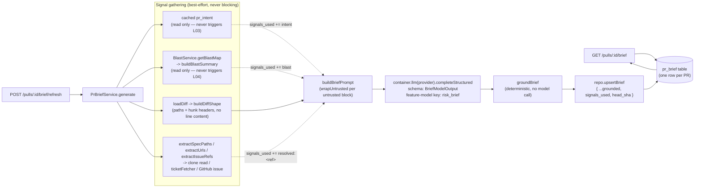

# PR Brief card (`modules/pr-brief/`)

How the shipped PR Brief card generates and serves its brief today. Intent and
acceptance criteria live in `specs/2026-08-27-pr-brief-card.md`
(`Status: shipped`) — this doc is the "how it works now" companion, not a
restatement of that spec.

`pr-brief` is the third module built on the `IntentClassifier` shape (after
`reviews/intent-classifier.ts` itself and `blast/service.ts`): a plugin with a
thin `routes.ts`, a service that owns all I/O, and a sibling `*-signals.ts`
file that holds the pure text-shaping and filtering logic so it is unit
testable without a DB or an LLM.

## What it returns

`PrBrief` (`@devdigest/shared`, `contracts/brief.ts`) —
`{ what, why, risk_level, risks[], review_focus[], signals_used[], head_sha }`.
This type **repurposes** an older, unused `PrBrief` shape
(`{ intent, blast, risks, history }`) that nothing read or wrote; the old
building blocks (`BlastRadius`/`Risks`/`PrHistory`/`SmartDiff`-adjacent types)
were removed from `contracts/brief.ts` on repurpose. The `pr_brief` table
(`db/schema/reviews.ts`) is the same table the old shape would have used,
carrying a nullable `head_sha text` column added by migration
`0016_omniscient_supreme_intelligence.sql` — one row per PR, overwritten on
regenerate, mirroring `pr_intent`.

## Routes

- `GET /pulls/:id/brief` — cached-read. Returns the cached `PrBrief` or `null`
  if one was never generated. Makes **zero** LLM calls.
- `POST /pulls/:id/brief/refresh` — forced generation. Always makes exactly
  one structured LLM call, persists the result, and returns it. Rate-limited
  at `{ max: 10, timeWindow: '1 minute' }` — the same budget as
  `/pulls/:id/intent/refresh`, since this is an AI-generation endpoint.

There is no implicit-generation path: unlike the Intent Layer (which
classifies on the first review request as well as on manual refresh), a brief
is generated **only** via the explicit refresh route. Both routes resolve the
PR under the caller's workspace (`PrBriefService.resolvePrAndRepo`, mirroring
tenancy checks elsewhere) before reading or writing anything.

**Staleness is computed client-side, not server-side.** The `GET` response
carries its own `head_sha`; the client compares it against the PR's current
head SHA to decide whether to show the "stale, regenerate?" affordance. The
server never blocks a stale read — it just serves whatever is cached.

## Data flow

- **Signal gathering degrades independently, never fails the request.** A
  missing cached Intent, a missing or `degraded` Blast map, a thin PR body (no
  linked issue, no resolvable spec path) — each is simply absent from
  `signals_used` and from the prompt. The brief still generates from whatever
  is left, down to diff shape alone. This is what backs AC-11/AC-12: the
  service never blocks on, or fails because of, an unavailable upstream
  signal.
- **`buildBlastSummary` never sends the raw `PrBlastMap`.** It reduces the map
  to the top symbols (name + file, capped at `MAX_REFS_PER_KIND`), impacted
  endpoint/cron labels (same cap), and the map's `counts` — never the full
  caller lists. A `degraded`-status blast map is treated as no blast map at
  all (it carries no real symbols worth summarizing).
- **Diff content never reaches the model.** `buildDiffShape` (reused from
  `reviews/intent-signals.ts`) reduces the diff to paths,
  additions/deletions, and hunk headers — the same discipline the Intent
  Layer already established.
- **Everything author-controlled is wrapped.** PR title, PR body, and any
  resolved issue/spec content are passed through `wrapUntrusted(...)` blocks;
  the system prompt instructs the model to treat their contents as data, never
  instructions, in any language — reusing the same posture as
  `intent-signals.ts`'s `SYSTEM_PROMPT`. Spec-path resolution stays inside the
  repo clone via the same traversal guard as
  `IntentClassifier.readClonedSpec`.
- **Grounding runs after the LLM call, before persist, and never calls a
  model.** `buildInputSet` unions every path/label actually shown to the
  model (diff-shape paths, blast-summary files/endpoints/crons, resolved
  reference labels). `groundBrief` then filters the model's output against
  that set: an ungrounded `refs` entry is dropped from a `risks[]` item (the
  risk itself survives — `risks[]` and `review_focus[]` are independent), and
  a `review_focus[]` item is dropped entirely if its single `ref` is
  ungrounded, since nothing clickable is left without it.
- **`signals_used` and `head_sha` are server-set, never model-reported** —
  the same discipline `Intent.confidence`/`signals_used` already established:
  a self-reported confidence or provenance field is not verifiable.

## Model selection

Generation goes through `resolveFeatureModel(container, workspaceId,
'risk_brief')` — a new feature-model key (`contracts/platform.ts`) alongside
`review_intent`, letting an operator pick a different (typically cheaper)
model for brief generation than for the main review.

## Testing

Split the usual way: `pr-brief-signals.test.ts` and `service.test.ts` are
hermetic (mocked LLM/GitHub/clone reads via `src/adapters/mocks.ts`);
`pr-brief.it.test.ts` is DB-backed (`*.it.test.ts`, testcontainers Postgres)
and exercises both routes end-to-end, including the rate limit and the
cached-vs-stale read paths.
