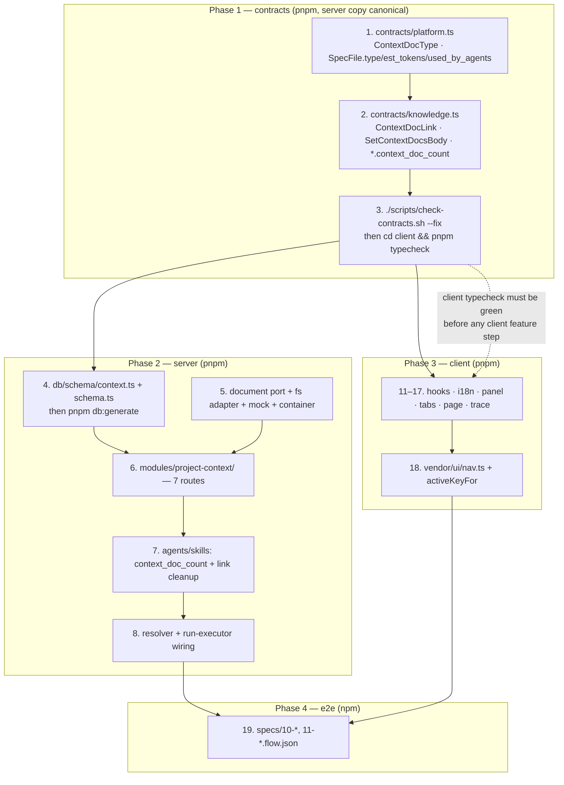
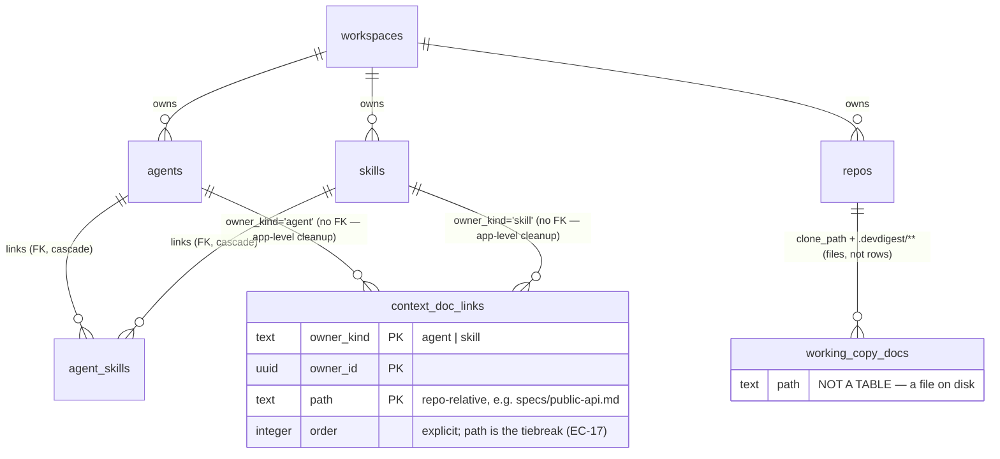

# Project Context — Development Plan (SPEC-cross-05)

Status: ready for implementation. Derived from `specs/2026-08-25-project-context.md`,
which is the authority — if this plan and the spec disagree on *what* to build,
the spec wins; on *how*, this file wins.

Plan scope is deliberately `server` + `client` + `e2e`. `reviewer-core/` is not
touched, by the spec's own finding.

## Objective

Wire the already-built-and-inert Project Context path end to end: discover the
markdown under a repository's `.devdigest/{specs,docs,insights}`, let an operator
attach documents to an **agent** or a **skill** with an order, resolve that
effective set at run time, and inject it verbatim through `assemblePrompt`'s
existing `specs` slot as untrusted-delimited blocks — plus the three UI surfaces
(N6 page, agent `?tab=context`, skill `?tab=context`) and the trace block that
proves what was sent.

"Done" means all 46 acceptance criteria in the spec are satisfied by the code and
observable by the verification method the criterion names; an agent with **no**
attached documents produces a prompt byte-identical to today's (NFR-1); and a run
whose attached document has vanished from the repository still completes, with the
skip named in its trace (EC-5).

## Requirements reviewed

Per root `CLAUDE.md`'s "Before answering" order:

- **`specs/`** — `specs/2026-08-25-project-context.md` (the input, read in full);
  `specs/01-skills.md` (attachment *is* enablement; `skills.enabled = false` beats
  attachment; ordering logic must be a pure unit-tested function with the drag as a
  thin shell); `specs/02-skill-detail-tabs.md` (`?tab=` convention on skill detail);
  `specs/04-blast-radius.md` (silent truncation is the failure mode this repo has
  been bitten by — cited by NFR-4); `specs/README.md` (spec/plan lifecycle, EARS
  annotation, who owns which artifact).
- **`docs/`** — `docs/agent-prompts/README.md:50-51` (documented prompt section
  order — the engine renders `## Repo skeleton` before `## Project context`;
  EC-18 rules that the engine wins over the mock). No `server/docs/` or
  `client/docs/` content exists beyond `README.md` stubs.
- **`INSIGHTS.md`** — root (Codebase Patterns: the two vendored `@devdigest/shared`
  copies are independent files with no sync script, 2026-08-04; the "shipped but one
  argument unpassed" pattern this feature is the fourth instance of; the authoring
  vs review skill-load split, 2026-08-24). `server/INSIGHTS.md` (2026-08-14: one
  grouped-aggregate query with an optional `id?` filter serves both the list footer
  and the single-item view — directly applicable to `used_by_agents` /
  `context_doc_count`; 2026-08-21: `export *` across the shared barrel has no
  near-synonym collision check; 2026-07-31: schema-first validation at the route
  boundary). `client/INSIGHTS.md` (2026-08-14: `vendor/ui/nav.ts` **is** the only
  place a nav item can land — `Sidebar.tsx:45` imports `NAV` directly with no
  prop-based extension point, and `activeKeyFor` already anticipates `/context`;
  2026-08-21: pass `t` as an explicit prop to private sub-components; 2026-08-19:
  extend a shared render component with optional props rather than forking).
- **Source** — read to ground the steps: `reviewer-core/src/prompt.ts`,
  `reviewer-core/src/review/run.ts`, `server/src/modules/reviews/run-executor.ts`,
  `server/src/db/schema/{agents,context,repos}.ts`, `server/src/platform/container.ts`,
  `server/src/adapters/{mocks.ts,tickets/types.ts,git/simple-git.ts}`,
  `server/src/modules/{agents,skills,repos,conventions}/`,
  `server/src/vendor/shared/{index.ts,adapters.ts,contracts/{platform,knowledge,trace}.ts}`,
  `server/src/db/seed.ts`, `client/src/lib/{api.ts,hooks/*}`, `client/src/vendor/ui/nav.ts`,
  `client/src/vendor/ui/primitives/Markdown.tsx`, `client/src/components/app-shell/helpers.ts`,
  `client/src/app/agents/[id]/_components/AgentEditor/**`,
  `client/src/app/skills/_components/SkillDetail/constants.ts`,
  `.../RunTraceDrawer/_components/TraceBody/TraceBody.tsx`, `client/messages/en/*.json`,
  `scripts/{check-contracts.sh,e2e.sh}`, `TESTING.md`, `e2e/run.ts`, `e2e/README.md`.

## Scope & Modules

| Package | Touched | Why |
|---|---|---|
| `server/` (pnpm) | **yes** | Contracts (canonical copy), new `context_doc_links` table + migration, read-only document port + fs adapter + mock, new `project-context` module (7 routes), `context_doc_count` on agents/skills, run-time resolution in `run-executor.ts`, seed fixture |
| `client/` (pnpm) | **yes** | Contract mirror (mechanical), 5 new hooks, i18n keys, shared attach panel, two `?tab=context` tabs, the N6 page, one deliberate `vendor/ui/nav.ts` edit, trace label |
| `e2e/` (npm) | **yes** | Two new `specs/*.flow.json` flows covering the nine e2e-verified ACs |
| `reviewer-core/` | **no** | The `specs` slot, `wrapUntrusted`, section order and `sectionSizes()` omit-rather-than-zero are already correct (`prompt.ts:67`, `:125`, `:143-146`, `:202-206`; `review/run.ts:60`, `:150`). Editing it would contradict the spec and change every existing agent's prompt |
| `mcp-server/` | **no** | Unrelated surface |

## Confirmed decisions (do not re-litigate)

| Decision | Value |
|---|---|
| `reviewer-core` | **No changes.** Resolver passes texts to the existing slot and must never build the `## Project context` section itself — that is what keeps the untrusted fence unbypassable |
| Contract order | `server/src/vendor/shared/contracts/` **first** → `./scripts/check-contracts.sh --fix` → `cd client && pnpm typecheck`. The two vendored trees are independent files with no sync script (root `INSIGHTS.md`, 2026-08-04) |
| Package managers | `server/` + `client/` = **pnpm**; `e2e/` = **npm**. Never crossed |
| Document identity | Repository-relative **path**, no document id, no FK to a document row (EC-12, EC-15) |
| Attachment storage | One new table `context_doc_links(owner_kind, owner_id, path, "order")`, composite PK over the first three, mirroring `agent_skills` (`db/schema/agents.ts:51-63`). No `enabled` column — attachment *is* enablement (`specs/01-skills.md`) |
| Owner cascade | A polymorphic `owner_id` **cannot** carry a Postgres FK to two parent tables, so the spec's "cascade-delete with the owning agent or skill" is implemented in `AgentsService.delete` / `SkillsService.delete`, in the same transaction as the delete. See **R-1** for the alternative |
| Document port | **Server-local** port (`src/adapters/context-docs/`) resolved through `platform/container.ts`, not a new interface in `vendor/shared/adapters.ts` — precedent: `TicketFetcher` (`adapters/tickets/types.ts`), `DepGraph`, `Tokenizer`. The client has no use for it, so putting it in the vendored tree would drag it through `check-contracts.sh` for nothing |
| Path containment | Enforced **inside the adapter**, via `realpath` + prefix check against the three resolved directories, and rejected **before any read** (AC-4's exact wording) |
| Route validation | Zod `params`/`querystring`/`body`/response from `@devdigest/shared` via `fastify-type-provider-zod` — never a hand-rolled `Schema.parse` (`server/CLAUDE.md`) |
| Not-synced signal | A **distinct** `AppError` code, not the generic `validation_error` that `conventions/service.ts:31` reuses — AC-6 requires the client to tell it apart from an empty list, and `ApiError.code` (`client/src/lib/api.ts:11`) is the field it branches on |
| Module placement | New `server/src/modules/project-context/` registered in `src/modules/index.ts` — the house default the spec names |
| Run-time failure mode | Best-effort: a missing/unreadable document is **skipped and logged**, never fatal — deliberately unlike skills (`run-executor.ts:232-241`), per EC-5 |
| Prompt omission | `...(texts.length > 0 ? { specs: texts } : {})`, the same spread `skills`/`callers`/`repoMap` already use at `run-executor.ts:273-278`. That spread *is* NFR-1 |
| Token estimate | `ceil(chars / 4)` — same formula as `estimateTokens` (`prompt.ts:198-200`), presented as an estimate, never as a billed figure. Amber ≥ 25 000, red ≥ 50 000, advisory only |
| Versioning | Attachment changes never bump `agents.version` and never write `agent_versions` (AC-21) |
| Not built | Editing, saving, uploading, creating documents; embeddings/chunking; the `78 COVERAGE` ring. `context.mode.edit`, `context.editor.*`, `context.chunks`, `context.indexStatus`, `context.resync*` stay in the catalog and stay unused |
| Nav entry | A **deliberate** vendored edit to `client/src/vendor/ui/nav.ts`, the same class of exception root `CLAUDE.md` grants `vendor/shared`. Precedent and rationale already recorded in `client/INSIGHTS.md` (2026-08-14) |
| Trace copy | `client/messages/en/runs.json:53` `prompt.specs` is the **only** existing string whose value changes |

## Architecture

### Build order — the ordering trap, drawn



The dashed edge is the trap: a contract edited on the server side and not synced
compiles green in **both** packages and only fails in the browser
(`scripts/check-contracts.sh:8-13`). Step 3 is not paperwork.

### The new table and what it does *not* reference



`working_copy_docs` is drawn only to make the absence explicit: there is no
document row anywhere, which is exactly why an attachment survives a delete and
re-create at the same path (AC-17) and why it can be made against one repository
and resolved against another (EC-12).

### Layering (onion) for the server work

- `routes.ts` — Zod schema, `getContext(container, req)`, call the service, map to
  a status. Nothing else (`onion-architecture` §Checklist 4).
- `service.ts` — orchestrates the document port + the links repository; owns the
  "effective set" and "not synced" rules.
- `repository.ts` — the only file issuing Drizzle queries against `context_doc_links`.
- `adapters/context-docs/` — the outer ring: `fs`, `realpath`, walking. The only
  place `node:fs` appears for this feature.
- `run-executor.ts` reaches the links **through `container.contextDocsRepo`**, never
  by importing another module's `repository.ts` (`onion-architecture` §Instructions 1,
  the same rule `container.agentsRepo` already exists for).

## Execution Mode

**Multi-agent pipeline** (the default), run by `/run-plan`
(`.claude/skills/run-plan/SKILL.md`): `implementer` executes the Steps in order,
then `plan-verifier` and `architecture-reviewer` run in parallel over the
Implementation Report, then a fix loop. The Steps and their skill assignments are
identical under a single-agent pass; the only difference is who reviews.

One consequence worth stating because it changes what the implementer must do:
`/run-plan` **skips `test-writer` by default**. Twenty-four of the 46 ACs name a
test as their verification method. The per-step `tests:` commands below are the
gate, and the test artifacts named in Steps 9, 13, 16, 17, 18 and 19 are
**deliverables of those steps**, not a later pass. See Open questions Q-A.

## Steps

Order rationale: contract-first is a hard dependency and wins over skill grouping
for Steps 1–3. Everything after that is grouped so a skill loads once.
Exact paths are given for every file that exists today; globs appear only for
files that do not exist yet.

### Phase 1 — contracts (pnpm; server copy canonical)

1. **Extend the Project Context contracts.** — files:
   `server/src/vendor/shared/contracts/platform.ts` (the `// ---- Project Context ----`
   block at `:262-277`).
   Add `ContextDocType = z.enum(['specs','docs','insights'])`. `SpecFile` gains
   `type: ContextDocType` (**required**), `est_tokens: z.number().int().nullish()`,
   `used_by_agents: z.number().int().nullish()`; `path` gains a `.max()` bound (see
   **R-2**) and a `.describe()` saying it is repository-relative. `content` stays
   nullish — null in list responses, non-null in the single-document response.
   `IndexStatus` unchanged; `chunks_indexed` stays null in v1.
   Before naming the new exports, grep the barrel for near-synonyms — the
   `BlastRadius`/`BlastResult` near-miss is a recorded trap (`server/INSIGHTS.md`,
   2026-08-21). — skills: [zod, response-schema] — tests: `cd server && pnpm typecheck`
   — **ACs: AC-1, AC-2, AC-8, AC-20 (contract side)**

2. **Add the attachment contracts.** — files:
   `server/src/vendor/shared/contracts/knowledge.ts` (`AgentSkillLink` at `:353-358` is
   the model; `Agent` at `:328`, `Skill` at `:121`).
   Add `ContextDocLink { owner_kind: z.enum(['agent','skill']), owner_id, path, order }`
   and `SetContextDocsBody { paths: z.array(<bounded path>) }` (set-and-reorder in one
   call). Add `context_doc_count: z.number().int().nullish()` to both `Agent` and
   `Skill`, with the same "omit rather than report a wrong 0" comment `skill_count`
   carries. The `paths` element schema is the **first** traversal gate: reject
   absolute paths and any `..` segment at the schema layer so `422` happens before the
   handler runs (AC-16). — skills: [zod, response-schema] — tests: `cd server && pnpm typecheck`
   — **ACs: AC-4 (querystring schema), AC-13, AC-14, AC-15, AC-16 (schema layer)**

3. **Sync the contract to the client and prove both sides compile.** — files:
   `client/src/vendor/shared/**` (written by the script — do not hand-edit).
   Run `./scripts/check-contracts.sh --fix`, then typecheck both packages. Nothing
   else in this step; a client feature step that starts before this one is the
   failure mode `check-contracts.sh:8-13` exists to catch. — skills: [response-schema]
   — tests: `./scripts/check-contracts.sh` (clean) · `cd server && pnpm typecheck` ·
   `cd client && pnpm typecheck`
   — **ACs: AC-8 (contract check)**

### Phase 2 — server storage (pnpm)

4. **Add `context_doc_links` and generate the migration.** — files:
   `server/src/db/schema/context.ts` (new table alongside `codeChunks`),
   `server/src/db/schema.ts` (add to the `import {...} from './schema/context'` line
   and to the `schema` object).
   `owner_kind: text({ enum: ['agent','skill'] })`, `owner_id: uuid`, `path: text`,
   `order: integer().notNull().default(0)`, `primaryKey({ columns: [ownerKind, ownerId, path] })`.
   **No** FK on `owner_id` (polymorphic — see Confirmed decisions and R-1); **no** FK
   to any document row; no `enabled` column. `path` must be length-bounded before it
   enters a btree PK — this file already carries the precedent and the reason
   (`MAX_INDEXED_NAME_LEN` / `clampIndexedName`, `context.ts:20-29`: Postgres rejects
   an index row over ~2704 bytes). Then `cd server && pnpm db:generate` — never
   hand-write the migration file (`server/CLAUDE.md`). — skills:
   [drizzle-orm-patterns, postgresql-table-design] — tests: `cd server && pnpm typecheck`;
   the generated file under `server/src/db/migrations/` is reviewed, not edited
   — **ACs: AC-13, AC-14, AC-15, AC-17, AC-21 (nothing written to `agent_versions`)**

### Phase 3 — server ports, routes, resolution (pnpm)

5. **Read-only document port + fs adapter + fake + container wiring.** — files:
   `server/src/adapters/context-docs/types.ts` (new — the port, modelled on
   `adapters/tickets/types.ts`), `server/src/adapters/context-docs/fs.ts` (new),
   `server/src/adapters/mocks.ts` (add the fake next to `MockGitClient`),
   `server/src/platform/container.ts` (`ContainerOverrides.contextDocs?` + a lazy
   getter, mirroring `ticketFetcher` at `:139-142`).
   Two operations only: `list(clonePath)` → `{ path, type, size, updatedAt }[]`
   walking `.devdigest/{specs,docs,insights}` recursively and keeping only `.md`
   (AC-2, AC-3), returning `[]` when a directory is absent (AC-5); and
   `read(clonePath, path)` → full UTF-8 text (AC-9), throwing a path-naming error on
   an undecodable file rather than returning partial content (AC-11).
   **Containment lives here**, checked with `realpath` against the three resolved
   directories so a symlink escaping the working copy is rejected too, and checked
   **before** the file is opened (AC-4's "without reading any file"). The fake is
   what makes AC-1…AC-11 testable without a real clone. — skills: [onion-architecture]
   — tests: `cd server && pnpm exec vitest run --exclude '**/*.it.test.ts'`
   — **ACs: AC-1, AC-2, AC-3, AC-4, AC-5, AC-9, AC-11, AC-16 (adapter layer)**

6. **New `project-context` module — the 7 routes.** — files:
   `server/src/modules/project-context/routes.ts`,
   `server/src/modules/project-context/service.ts`,
   `server/src/modules/project-context/repository.ts`,
   `server/src/modules/project-context/constants.ts` (all new),
   `server/src/modules/index.ts` (one import + one registry entry),
   `server/src/platform/container.ts` (add a `contextDocsRepo` getter beside
   `agentsRepo`/`reviewRepo` at `:100-106`, so Step 8 can reach the links without
   importing this module's `repository.ts`).

   | Method + path | Schema | Notes |
   |---|---|---|
   | `GET /repos/:id/context` | → `SpecFile[]` | metadata only, `content` null (AC-8); `est_tokens` and `used_by_agents` filled |
   | `GET /repos/:id/context/doc` | `?path=` → `SpecFile` | `content` non-null |
   | `POST /repos/:id/context/reindex` | → `IndexStatus` | re-walks the working copy; `chunks_indexed` null |
   | `GET /agents/:id/context-docs` | → `ContextDocLink[]` | mirrors `agents/routes.ts:145-150` |
   | `POST /agents/:id/context-docs` | `SetContextDocsBody` → `ContextDocLink[]` | set-and-reorder; `order` rewritten from array index |
   | `GET /skills/:id/context-docs` | → `ContextDocLink[]` | mirrors `skills/routes.ts:94-99` |
   | `POST /skills/:id/context-docs` | `SetContextDocsBody` → `ContextDocLink[]` | |

   Repo-scoped routes resolve `clonePath` from `repos` (the query already exists as
   a pattern: `conventions/repository.ts:32-35`) and throw the **distinct**
   not-synced error when it is null (AC-6) — not `conventions/service.ts:31`'s
   generic `ValidationError`, which would be indistinguishable from the traversal
   `422`. Attachment routes are workspace-scoped through `getContext`; a
   cross-workspace owner id is a 404, deny by default. `used_by_agents` counts the
   **effective** users — directly attached **or** inherited through a linked,
   globally enabled skill — in one grouped query with an optional path filter, per
   `server/INSIGHTS.md` 2026-08-14 (**R-5**). — skills:
   [onion-architecture, fastify-best-practices, zod, drizzle-orm-patterns] — tests:
   `cd server && pnpm exec vitest run --exclude '**/*.it.test.ts'`
   — **ACs: AC-1, AC-4, AC-5, AC-6, AC-7, AC-8, AC-9, AC-11, AC-13, AC-14, AC-15, AC-16, AC-17, AC-20**

7. **`context_doc_count` on agents/skills, and owner-delete cleanup.** — files:
   `server/src/modules/agents/repository.ts`, `server/src/modules/agents/service.ts`,
   `server/src/modules/skills/repository.ts`, `server/src/modules/skills/service.ts`.
   Populate `context_doc_count` on list and single reads (same grouped-aggregate
   shape as `SkillsRepository.usedByCounts`). Delete the owner's `context_doc_links`
   rows inside the existing delete path, in the same transaction — this is the
   substitute for the FK cascade a polymorphic `owner_id` cannot have. **Do not**
   touch `agents.version` or write an `agent_versions` snapshot from any attachment
   path (AC-21). — skills: [onion-architecture, drizzle-orm-patterns] — tests:
   `cd server && pnpm exec vitest run --exclude '**/*.it.test.ts'`
   — **ACs: AC-21, AC-44 (badge data)**

8. **Run-time resolution: pure resolver + one `run-executor` step.** — files:
   `server/src/modules/reviews/context-docs.ts` (new — pure: effective order, dedup,
   tiebreak), `server/src/modules/reviews/context-docs.test.ts` (new — hermetic),
   `server/src/modules/reviews/run-executor.ts`.
   The pure function takes the agent's links, its linked-and-globally-enabled skills'
   links in the agent's skill order, and returns the ordered, deduped path list:
   agent-direct first, dedup keeps the **earliest** position (AC-26, AC-27), a
   globally disabled skill contributes nothing (AC-28, `specs/01-skills.md`), ties on
   `order` break by path so two identical configurations produce a byte-identical
   section (EC-17, NFR-8).
   In `run-executor.ts`, add **one** `runLog.step('Resolving project context', …)`
   beside the skills resolution at `:237-241` (NFR-7: at most one extra step of
   observable progress), reading each path through the document port and *continuing*
   past a failure — the opposite of the skills path's fail-the-run behaviour, per
   EC-5. Then:
   - pass `...(texts.length > 0 ? { specs: texts } : {})` into `reviewPullRequest`
     alongside the existing spreads at `:273-278` (AC-29, AC-30, AC-31, AC-39);
   - replace `specs_read: []` at `:386` with the injected paths **in injected order**,
     omitted documents excluded (AC-34, AC-35);
   - log one line per skipped document with its path and reason — **paths only, never
     content**, the rule already stated at `:38-42` (AC-33, NFR-11);
   - leave `traceFromBuffer`'s `specs: null` / `specs_read: []` at `:628`/`:632`
     as-is — a failed run assembled no prompt, and NFR-12 requires old traces to keep
     parsing;
   - fix `PROMPT_SECTION_SOURCE.specs` (`:38-42`), currently
     `'project context (repo-intel)'`, which becomes factually wrong the moment this
     step lands (**R-8**).
   Do **not** build the `## Project context` section here — pass texts to the slot
   (Untrusted inputs §1). — skills: [onion-architecture] — tests:
   `cd server && pnpm exec vitest run --exclude '**/*.it.test.ts'`
   — **ACs: AC-26, AC-27, AC-28, AC-29, AC-30, AC-31, AC-32, AC-33, AC-34, AC-35, AC-38, AC-39**

9. **DB-backed integration tests.** — files:
   `server/test/project-context.it.test.ts` (new),
   `server/test/context-docs-run.it.test.ts` (new — modelled on
   `server/test/skills-prompt.it.test.ts`, the existing "attachment reaches the
   assembled prompt" test).
   Cover the twelve `*.it.test.ts`-verified criteria: list shape and metadata (AC-1),
   traversal `422` on read and on attach (AC-4, AC-16), no directories → `[]` not an
   error (AC-5), no working copy → the distinct not-synced error (AC-6), single-doc
   verbatim (AC-9), attach/reorder round-trips (AC-13, AC-14, AC-15), delete +
   re-create at the same path is still attached (AC-17), `used_by_agents` counts
   inherited users too (AC-20), attachment change leaves `agents.version` alone
   (AC-21), a run with a missing attached document still completes (AC-32) and says
   what it skipped (AC-33), and `specs_read` carries the injected paths in order
   (AC-34). **Assert on the trace by polling `run_traces`, not by waiting on run
   status** — the two are separate statements in `run-executor.ts` and the naive
   version passes on an idle machine (`TESTING.md`). — skills:
   [onion-architecture, fastify-best-practices] — tests:
   `cd server && pnpm exec vitest run .it.test` (Docker required; deferred to CI if
   unavailable)
   — **ACs: AC-1, AC-4, AC-5, AC-6, AC-9, AC-13, AC-14, AC-15, AC-16, AC-17, AC-20, AC-21, AC-32, AC-33, AC-34**

10. **Seed a `.devdigest/` fixture so the e2e flows have something to see.** — files:
    `server/src/db/seed.ts` (the seeded repo currently sets `clonePath: null` at
    `:108`), `scripts/e2e.sh` (env exports around `:35-40`, seed at `:127-128`).
    Behind an env flag (default off), write a three-file fixture — one document per
    type — under `${config.cloneDir}/acme/payments-api/.devdigest/{specs,docs,insights}/`
    and set the seeded repo's `clonePath`. `scripts/e2e.sh` exports the flag and an
    isolated `DEVDIGEST_CLONE_DIR` so the hermetic stack gets it and a developer's dev
    DB does not (a repo that suddenly reports a clone path would change repo-intel's
    behaviour for everyone). Without this step, the seeded repo has no working copy
    and the N6 page renders AC-6's not-synced state, which makes AC-7, AC-10, AC-13,
    AC-14, AC-15 and AC-42 unobservable. See Open questions Q-B. — skills:
    [drizzle-orm-patterns] — tests: `cd server && pnpm db:seed` against the isolated
    DB, then `ls "$DEVDIGEST_CLONE_DIR/acme/payments-api/.devdigest"`
    — **ACs: enables AC-7, AC-10, AC-13, AC-14, AC-15, AC-42**

### Phase 4 — client (pnpm)

11. **Hooks.** — files: `client/src/lib/hooks/context.ts` (new),
    `client/src/lib/hooks/index.ts` (barrel), `client/src/lib/hooks/core.ts` (the
    `// ---- Project Context (A3 contract; safe to call once API exposes it) ----`
    comment at `:121` is now stale — the endpoints exist; `useContextFiles` at `:122`
    and `useReindexContext` at `:130` need no code change).
    New in `context.ts`: `useContextDoc(repoId, path)` keyed `["context-doc", repoId, path]`
    so a preview is cached per document; `useAgentContextDocs(agentId)` /
    `useSetAgentContextDocs()`; `useSkillContextDocs(skillId)` /
    `useSetSkillContextDocs()`. Every set-mutation must invalidate
    `["context", repoId]` as well as its own key — that is the query `used_by_agents`
    and `context_doc_count` come from, and the spec calls this out explicitly. No
    `fetch` in a component; server state stays in TanStack Query and is never mirrored
    into `useState` (`client/CLAUDE.md`). — skills: [react-best-practices] — tests:
    `cd client && pnpm typecheck`
    — **ACs: supports AC-7, AC-10, AC-13, AC-14, AC-15, AC-20**

12. **i18n keys.** — files: `client/messages/en/context.json`,
    `client/messages/en/agents.json` (`editor.tabs.*` at `:46`),
    `client/messages/en/skills.json` (`detail.tabs.*` at `:39`).
    Add exactly the keys the spec's Copy section names: `type.{specs,docs,insights}`,
    `usedBy`, `footer.{documents,refreshed}`, `notSynced.{title,body}`,
    `doc.loadError`, `attach.{filter,badge,badgeSkill,orderHint,inherits,injectedAs,
    tokens,tokensEstimate,tokensWarning,missing,serializesAs,serializesAsHint}`, plus
    `editor.tabs.context` and the skill detail tab label. Leave `mode.edit`,
    `editor.*`, `chunks`, `indexStatus`, `resync*` untouched and unused. No inline
    literals anywhere in Steps 13–18 (NFR-10). — skills: none (message catalogs, not
    code) — tests: `cd client && pnpm test` (existing suites must stay green)
    — **ACs: AC-23, AC-24, AC-41 (copy side)**

13. **Shared attach panel + the pure logic behind it.** — files:
    `client/src/components/context-docs/helpers.ts`,
    `client/src/components/context-docs/helpers.test.ts`,
    `client/src/components/context-docs/constants.ts`,
    `client/src/components/context-docs/ContextDocsPanel.tsx`,
    `client/src/components/context-docs/ContextDocsPanel.test.tsx`,
    `client/src/components/context-docs/DocRow.tsx`,
    `client/src/components/context-docs/SerializesAsBox.tsx`,
    `client/src/components/context-docs/styles.ts`,
    `client/src/components/context-docs/index.ts` (all new).
    Shared, not colocated, because it has two consumers on day one — the promotion
    rule in `frontend-ui-architecture` §1. `helpers.ts` mirrors
    `AgentEditor/_components/SkillsTab/helpers.ts` almost exactly (`arrangeDocs`,
    `moveItem`, `attachedPathsInOrder`, `filterDocs` over the repo-relative path per
    AC-19) and adds `estTokens` (`ceil(chars/4)`, AC-22, excluding rows marked missing)
    and `tokenTier` (ok/amber/red against the constants in `constants.ts`, AC-24).
    All of it pure and unit-tested; the drag wiring stays a thin untested shell —
    jsdom cannot drive a drag, and reorder must be completable by keyboard alone
    (NFR-9, `specs/01-skills.md`). `DocRow` renders the type badge, the folder-prefixed
    path (EC-15), a `Preview` action, and the missing marker for an attached path
    absent from the list (AC-18) — a missing row stays detachable and is excluded from
    the token total. The zero-attached state shows the **full** list with a
    `0 of N attached` badge, never an error or a blank panel (AC-44). Attaching is
    never blocked by the token total (AC-25). Pass `t` down as an explicit prop rather
    than re-calling `useTranslations` in each sub-component (`client/INSIGHTS.md`,
    2026-08-21). — skills:
    [frontend-ui-architecture, react-best-practices, react-testing-library] — tests:
    `cd client && pnpm test`
    — **ACs: AC-18, AC-19, AC-22, AC-23, AC-24, AC-25, AC-40, AC-41, AC-44**

14. **Agent editor `?tab=context`.** — files:
    `client/src/app/agents/[id]/_components/AgentEditor/constants.ts` (append to `TABS`),
    `client/src/app/agents/[id]/_components/AgentEditor/AgentEditor.tsx` (`:23` is a
    two-way ternary today — a third tab needs a real branch, not a nested ternary),
    `client/src/app/agents/[id]/_components/AgentEditor/_components/ContextTab/**` (new:
    `ContextTab.tsx`, `ContextTab.test.tsx`, `index.ts`, `styles.ts`).
    A thin owner-specific shell over `ContextDocsPanel`: it supplies the repo-scoped
    document list, the agent's links, the set-mutation, and the agent-flavour copy
    (`attach.badge`, `attach.orderHint`, `attach.injectedAs`). Tab state already lives
    in `?tab=` on `client/src/app/agents/[id]/page.tsx`. — skills:
    [frontend-ui-architecture, react-best-practices, react-testing-library] — tests:
    `cd client && pnpm test`
    — **ACs: AC-13, AC-14, AC-44**

15. **Skill detail `?tab=context`.** — files:
    `client/src/app/skills/_components/SkillDetail/constants.ts` (append to `TABS`;
    `TAB_KEYS` is derived, so `?tab=context` validates for free),
    `client/src/app/skills/_components/SkillDetail/SkillDetail.tsx`,
    `client/src/app/skills/_components/SkillDetail/_components/ContextTab/**` (new).
    Same shell, skill-flavoured copy (`attach.badgeSkill`, `attach.inherits`), plus the
    **manifest preview** box: the real heading `## Project context`, the attached paths
    in injection order, and the caption stating each is injected in full inside an
    untrusted block (EC-19 → AC-40, AC-41). It must not print a heading the engine
    never emits, and it must not attempt to render the true serialization. — skills:
    [frontend-ui-architecture, react-best-practices, react-testing-library] — tests:
    `cd client && pnpm test`
    — **ACs: AC-15, AC-40, AC-41, AC-44**

16. **The Project Context page (N6).** — files:
    `client/src/app/repos/[repoId]/context/page.tsx` (new — thin, `useParams`, mirrors
    `client/src/app/repos/[repoId]/conventions/page.tsx`),
    `client/src/app/repos/[repoId]/context/_components/ProjectContextView/**` (new:
    `ProjectContextView.tsx`, `ProjectContextView.test.tsx`, `DocList.tsx`,
    `PreviewPane.tsx`, `helpers.ts`, `helpers.test.ts`, `styles.ts`, `index.ts`).
    States, all six of them, per the spec's table: skeleton while loading (no empty
    state until the request settles); `context.empty.*` when the list is empty
    (AC-42); the **distinct** not-synced state keyed off `ApiError.code` from Step 6,
    naming the repository and offering the action that fixes it (AC-6, EC-3); a
    retryable error state using `context.loadError` (AC-43); a select-a-document
    placeholder; and a preview pane with its own loading/error state so a failed body
    read does not blank the list (AC-11). Toolbar refresh calls the existing
    `useReindexContext` (AC-7). Footer is `N documents · last refreshed <relative>` —
    no chunk count. The preview renders through the existing vendored `Markdown`
    primitive (`client/src/vendor/ui/primitives/Markdown.tsx`) — see **R-6** before
    adding any sanitizer. **Render no control that edits, saves, uploads or creates**
    (AC-12); assert that absence in the test rather than trusting it. — skills:
    [frontend-ui-architecture, next-best-practices, react-best-practices, react-testing-library]
    — tests: `cd client && pnpm test`
    — **ACs: AC-6 (client side), AC-7, AC-10, AC-11 (client side), AC-12, AC-42, AC-43**

17. **Trace drawer: label, block order, omission.** — files:
    `client/messages/en/runs.json` (`prompt.specs` at `:53`:
    `"Project context (dynamic)"` → `"Project context — attached specs (untrusted)"`),
    `client/src/app/repos/[repoId]/pulls/[number]/_components/RunTraceDrawer/_components/TraceBody/TraceBody.test.tsx`
    (new).
    No component change is needed — `TraceBody.tsx:85-87` already renders the block
    when `prompt_assembly.specs != null` and omits it otherwise, and `PromptBlock`
    already gives it expand, copy and fullscreen. The test pins the two properties the
    ACs assert: blocks appear in the engine's assembly order — skills, memory, repo
    map, **specs**, callers (`reviewer-core/src/prompt.ts:143-150`,
    `docs/agent-prompts/README.md:50-51`; the mock's ordering loses per EC-18) — and a
    null `specs` renders no block at all rather than an empty one. — skills:
    [react-testing-library] — tests: `cd client && pnpm test`
    — **ACs: AC-36 (label), AC-38, AC-39**

18. **Nav entry (deliberate vendored edit) + active key.** — files:
    `client/src/vendor/ui/nav.ts` (the `WORKSPACE` group at `:21-26`),
    `client/src/components/app-shell/helpers.test.ts` (new).
    Add `{ key: "context", label: "Project Context", icon: <IconName>, href: "/repos/:repoId/context" }`
    between Pull Requests and the SKILLS LAB group, matching the artboard. `key` must
    be exactly `"context"` — that is what `activeKeyFor()` already returns for a path
    containing `/context` (`client/src/components/app-shell/helpers.ts:30`) and what
    `Sidebar.tsx:63` compares against, and it is also the existing `shell.nav.context`
    label key (`client/messages/en/shell.json:20`) the command palette resolves
    (`useShellCommands.ts:24`). `href` uses the existing `:repoId` template token.
    This is the only vendored edit in the plan and it is the same class of exception
    root `CLAUDE.md` grants `vendor/shared`; the precedent, including that `nav.ts`
    exists in exactly one place and has no sync gate, is recorded in
    `client/INSIGHTS.md` (2026-08-14). The new test pins `activeKeyFor` for the
    context route — there is no test for that helper today. — skills:
    [frontend-ui-architecture, react-testing-library] — tests:
    `cd client && pnpm test` · `cd client && pnpm typecheck`
    — **ACs: AC-45 (route + entry), AC-46**

### Phase 5 — e2e (npm)

19. **Two browser flows.** — files: `e2e/specs/10-project-context.flow.json`,
    `e2e/specs/11-context-attach.flow.json` (new; `e2e/run.ts:54` auto-discovers
    `specs/*.flow.json` in filename order).
    Flow 10 (read-only): sidebar shows Project Context (AC-45) → open it → the seeded
    documents list (AC-7 via the refresh button) → select one → its markdown renders in
    the preview (AC-10) → the empty state is reachable on a repository with no
    documents (AC-42) → open PR #482's run trace and expand
    `Project context — attached specs (untrusted)`, asserting an
    `<untrusted source="spec-` delimiter is visible in the expanded text (AC-36, AC-37).
    Flow 11 (mutating): agent editor → Context tab → toggle a document → reload → still
    attached (AC-13); reorder → reload → order preserved (AC-14); skill detail →
    Context tab → attach → reload (AC-15).
    Two constraints: deterministic locators only — `wait --url`, `wait --text`,
    `find role|text|label`; the AI `chat` command is banned and `npm run lint:flows`
    fails on it. And flow 11 **writes to the DB**, unlike every existing flow
    (`e2e/README.md`: "Flows target read-only seeded data") — it must run against the
    hermetic stack, which tears its Postgres down, and must not leave state flow 10
    depends on. — skills: none (`e2e/**` has no routed skill; use the checklist in
    `e2e/README.md`) — tests: `cd e2e && npm run e2e:hermetic` (or `./scripts/e2e.sh`)
    — **ACs: AC-7, AC-10, AC-13, AC-14, AC-15, AC-36, AC-37, AC-42, AC-45**

## Step groups by skill set

One load per group, per `.claude/skills/README.md` ("Load each skill at most once
per session").

- **Steps 1–3** — `zod` + `response-schema`. (Contract-first is a hard dependency
  and is why this group leads; `zod` stays loaded and is used again at Step 6.)
- **Step 4** — `drizzle-orm-patterns` + `postgresql-table-design`.
  `postgresql-table-design` is needed only here.
- **Steps 5–10** — `onion-architecture` + `fastify-best-practices` +
  `drizzle-orm-patterns` (carried over from Step 4) + `zod` (carried over from
  Phase 1).
- **Steps 11–18** — `frontend-ui-architecture` + `react-best-practices` +
  `react-testing-library`, with `next-best-practices` loaded once at Step 16.
  Step 12 needs none.
- **Step 19** — none.

## Skills to apply

Sourced from the **"Authoring load vs review load"** table in
`.claude/skills/README.md`. This is the contract `implementer` follows.

| Step | Skills |
|---|---|
| 1 | zod, response-schema |
| 2 | zod, response-schema |
| 3 | response-schema |
| 4 | drizzle-orm-patterns, postgresql-table-design |
| 5 | onion-architecture |
| 6 | onion-architecture, fastify-best-practices, zod, drizzle-orm-patterns |
| 7 | onion-architecture, drizzle-orm-patterns |
| 8 | onion-architecture |
| 9 | onion-architecture, fastify-best-practices |
| 10 | drizzle-orm-patterns |
| 11 | react-best-practices |
| 12 | — (message catalogs only) |
| 13 | frontend-ui-architecture, react-best-practices, react-testing-library |
| 14 | frontend-ui-architecture, react-best-practices, react-testing-library |
| 15 | frontend-ui-architecture, react-best-practices, react-testing-library |
| 16 | frontend-ui-architecture, next-best-practices, react-best-practices, react-testing-library |
| 17 | react-testing-library |
| 18 | frontend-ui-architecture, react-testing-library |
| 19 | — (`e2e/**` has no routed skill) |

`response-schema` is assigned at Steps 1–3 because `SpecFile`, `Agent` and `Skill`
are **existing** contracts gaining fields — that is the change-impact trigger, not
greenfield. `semver-discipline` and `deprecation-policy` are not assigned: the
change is additive only, nothing is removed, renamed, retyped or narrowed, and
`SpecFile.type` — a new *required* response field, normally the flagship accidental
MAJOR — has no existing producer, because the endpoints do not exist yet and their
sole producer is written in the same change.

`typescript-expert`, `security` and `pr-self-review` are deliberately **not**
assigned to any step; they are review lenses that run in `pr-self-review`'s fan-out,
where each gets its own cheap context. No step's own work is type-level, so the
`typescript-expert` exception does not apply either.

## AC coverage map

Every criterion, and the step(s) that deliver it.

| AC | Step(s) | AC | Step(s) |
|---|---|---|---|
| AC-1 | 1, 5, 6, 9 | AC-24 | 12, 13 |
| AC-2 | 1, 5 | AC-25 | 13 |
| AC-3 | 5 | AC-26 | 8 |
| AC-4 | 2, 5, 6, 9 | AC-27 | 8 |
| AC-5 | 5, 6, 9 | AC-28 | 8 |
| AC-6 | 6, 9, 16 | AC-29 | 8 |
| AC-7 | 6, 10, 16, 19 | AC-30 | 8 |
| AC-8 | 1, 3, 6 | AC-31 | 8 |
| AC-9 | 5, 6, 9 | AC-32 | 8, 9 |
| AC-10 | 10, 16, 19 | AC-33 | 8, 9 |
| AC-11 | 5, 6, 16 | AC-34 | 8, 9 |
| AC-12 | 16 | AC-35 | 8 |
| AC-13 | 2, 4, 6, 9, 10, 14, 19 | AC-36 | 17, 19 |
| AC-14 | 2, 4, 6, 9, 10, 13, 14, 19 | AC-37 | 19 |
| AC-15 | 2, 4, 6, 9, 10, 15, 19 | AC-38 | 8, 17 |
| AC-16 | 2, 5, 6, 9 | AC-39 | 8, 17 |
| AC-17 | 4, 6, 9 | AC-40 | 13, 15 |
| AC-18 | 13 | AC-41 | 12, 13, 15 |
| AC-19 | 13 | AC-42 | 10, 16, 19 |
| AC-20 | 1, 6, 9 | AC-43 | 16 |
| AC-21 | 4, 7, 9 | AC-44 | 7, 13, 14, 15 |
| AC-22 | 13 | AC-45 | 18, 19 |
| AC-23 | 12, 13 | AC-46 | 18 |

## Testing

Per `TESTING.md`'s suite map and the split root `CLAUDE.md` states.

| Suite | Command | When |
|---|---|---|
| server hermetic | `cd server && pnpm exec vitest run --exclude '**/*.it.test.ts'` | after Steps 5, 6, 7, 8 |
| server integration | `cd server && pnpm exec vitest run .it.test` | Step 9; Docker required, otherwise CI (`server-integration.yml`) |
| client | `cd client && pnpm test` | after Steps 12–18 |
| e2e | `cd e2e && npm run e2e:hermetic` | Step 19; CI `e2e-web.yml` |

Never `cd server && pnpm test` for the local loop — it boots testcontainers
Postgres. Never `npm` in `server/` or `client/`, never `pnpm` in `e2e/`.

`*.it.test.ts` files self-skip when Docker is unavailable, so a green hermetic run
proves nothing about Step 9's fifteen criteria. If Docker is not available locally,
say so in the Implementation Report rather than reporting a pass.

## Risks

| Risk | Why it bites | Mitigation in this plan |
|---|---|---|
| Contract edited, not synced | Compiles green in **both** packages; fails only in the browser | Step 3 is a standalone step with its own gate; `check-contracts.sh` runs in the `client` and `server` CI zones |
| Polymorphic owner has no FK | An agent deleted outside the service leaves orphan link rows | Step 7 deletes in the same transaction; orphans are invisible to reads because every count query joins `agents`/`skills`. **R-1** offers the structural fix |
| `path` inside a btree PK | Postgres rejects an index row > ~2704 bytes; this repo has already crashed an indexer this exact way (`db/schema/context.ts:20-29`) | Bounded `path` in the contract (Step 1) and in the schema (Step 4) — **R-2** |
| e2e has no working copy | Seed sets `clonePath: null` (`seed.ts:108`); six e2e ACs would silently observe the not-synced state instead | Step 10, behind an env flag; Q-B records the decision |
| Symlink escapes the working copy | A string-prefix containment check passes a symlink pointing at `/etc` | `realpath`-based containment inside the adapter (Step 5), before any read — **R-7** |
| Author-controlled markdown in the browser | Stored XSS where the store is a git repository | Existing `Markdown` primitive is `react-markdown` 9 with no `rehype-raw` (raw HTML escaped) and the default safe `urlTransform`. **Verify, do not add a sanitizer** — **R-6** |
| A run's cost dominated by one document | No cap, no truncation, by design (NFR-4) | The visible in-place estimate before running is the mitigation; the UI warns and never blocks (AC-24, AC-25) |
| `used_by_agents` counts only direct attachments | Would report "0 agents" for a document three agents inject through a shared skill — the most misleading possible number | Step 6 counts the **effective** set, direct + inherited, in one grouped query — **R-5** |
| Trace order disagrees with the mock | The screenshot lists Project context before Repo skeleton | The engine wins (EC-18); Step 17 pins the engine's order in a test so a later "fix" to match the mock fails loudly |

## Recommendations

Improvements on the spec's implementation *shape*. None of these change scope, and
none are applied silently — each names what the Steps do today and what I would
change.

- **R-1 — two link tables instead of one polymorphic table.** The spec asks for one
  table keyed on `(owner_kind, owner_id, path)` **and** for cascade-delete with the
  owning agent or skill. Postgres cannot give both: `owner_id` cannot reference two
  parent tables, so the cascade becomes application code (Step 7) and the DB stops
  being the thing that guarantees it. `agent_context_docs(agent_id, path, "order")`
  and `skill_context_docs(skill_id, path, "order")` — each a literal mirror of
  `agent_skills` — restore a real `ON DELETE CASCADE`, keep every PK column
  `NOT NULL`, and give the FK column its index for free as the PK's leading column
  (`postgresql-table-design`: "PostgreSQL does not auto-index FK columns"). The
  `ContextDocLink` contract stays polymorphic and unchanged; only the repository maps
  differently, and `used_by_agents` becomes a `UNION ALL` instead of a filter. This
  is a storage decision the spec owner should confirm — the Steps implement the
  spec's single-table shape until they do.
- **R-2 — bound `path` in the contract, not only in the adapter.** `path` is a btree
  PK column and a query-string parameter. A `.max()` on the Zod schema turns a
  pathological path into a `422` at the route boundary instead of a Postgres
  `index row size … exceeds btree version 4 maximum` deep in the repository — the
  failure this file already documents (`db/schema/context.ts:20-29`).
- **R-3 — give "not synced" its own error code.** `conventions/service.ts:31` throws
  a generic `ValidationError` (`code: 'validation_error'`, `422`) for exactly this
  case, which the traversal rejection also uses. AC-6 requires the client to
  distinguish not-synced from an empty list, and `client/src/lib/api.ts:11` already
  surfaces `error.code`. A dedicated code (or `409`) is one line and makes Step 16's
  state machine honest.
- **R-4 — build the attach panel once, shared.** Two consumers exist on day one, so
  `frontend-ui-architecture`'s promotion rule applies immediately: put it in
  `client/src/components/context-docs/` (Step 13) with thin owner shells, rather than
  writing it in the agent tab and copying it into the skill tab. The pure-helpers +
  thin-drag-shell split is not optional — it is how `SkillsTab` is already tested and
  what NFR-9 requires.
- **R-5 — one grouped query with an optional filter, not two.** `used_by_agents` (per
  document, across the list) and `context_doc_count` (per owner) are the same
  aggregate at two granularities. `server/INSIGHTS.md` (2026-08-14) records the exact
  pattern — an optional `id?` pushed into the `WHERE` via a `conditions: SQLWrapper[]`
  array, not `and(..., maybe-undefined)`, because TypeScript's overload resolution on
  `and()` gets ambiguous with a conditionally-undefined argument.
- **R-6 — do not add a markdown sanitizer.** `client/src/vendor/ui/primitives/Markdown.tsx`
  uses `react-markdown` ^9 with `remark-gfm` and **no** `rehype-raw`, so raw HTML is
  escaped, and v9's default `urlTransform` already drops non-safe protocols. The
  correct work is a test asserting both properties against a hostile fixture — not a
  second sanitizer, and certainly not a second vendored edit.
- **R-7 — reject before opening.** AC-4 says "without reading any file". Resolve with
  `realpath` and compare against the three resolved directory roots *before* the
  `readFile`, so a symlink escape and a `..` escape fail the same way, and neither
  produces a partial read.
- **R-8 — fix the section-source label while you are in the file.**
  `PROMPT_SECTION_SOURCE.specs` reads `'project context (repo-intel)'`
  (`run-executor.ts:38-42`). Nothing about this feature comes from repo-intel, and
  that string is what the structured assembly log prints. One word, in the step that
  makes it wrong.
- **R-9 — keep the seed fixture behind a flag.** Setting `clonePath` on the seeded
  repo unconditionally would make every developer's demo repo look cloned, which
  changes repo-intel's behaviour for an unrelated feature. Flagged and exported by
  `scripts/e2e.sh` costs two lines and touches nobody else.
- **R-10 — one `runLog.step`, not one per document.** NFR-7 allows resolution to add
  **at most one** step to observable progress. Twenty documents must not become twenty
  SSE steps; the per-document skips are `runLog.info` lines inside the single step.
- **R-11 — flow 11 is the first mutating e2e flow.** `e2e/README.md` states flows
  target read-only seeded data. Attaching writes rows. It is safe on the hermetic
  stack (ephemeral Postgres, fresh every run) but not against a developer's dev DB, and
  flows run in filename order against one shared browser session — so flow 11 must not
  leave state that flow 10 asserts on. Worth a sentence in the flow's own `name` field.

## Out of scope

- **Spec authoring or spec status changes** — `specs/2026-08-25-project-context.md`
  stays `Status: draft` until whoever owns that decision changes it, and `doc-writer`
  updates it after the change ships. Not this plan, not the implementer.
- **Documentation** — `server/README.md`'s API map, `client/README.md`'s route map,
  `e2e/README.md`'s coverage table and any `docs/` prose are `doc-writer`'s, post-ship.
- **Architecture and security review** — `architecture-reviewer` and
  `pr-self-review`'s fan-out, not a step here.
- **`reviewer-core` changes** of any kind, including the EC-18 section reorder.
- **Editing / saving / uploading / creating documents**, and the `Preview | Edit`
  toggle (Non-goals — the only copy of the file lives under `server/clones/**`, which
  root `CLAUDE.md` lists under "Do not touch", and the next resync destroys anything
  written there).
- **Embedding / chunk retrieval.** `code_chunks` stays empty,
  `IndexStatus.chunks_indexed` stays null.
- **The `78 COVERAGE` ring** and any invented coverage metric.
- **Versioning attachments** — no `agent_versions` snapshot, no version bump.
- **A token cap or truncation.**
- **Documents outside `.devdigest/{specs,docs,insights}`.**
- **Integration and e2e tests are deferred to CI** except where a step above says
  otherwise — Step 9 and Step 19 run locally only if Docker is available.

## Verification

Run in this order; each is the gate for the phase above it.

```sh
# Phase 1 — contracts
cd server && pnpm typecheck
./scripts/check-contracts.sh            # must print "contracts in sync"
cd client && pnpm typecheck

# Phase 2–3 — server
cd server && pnpm db:generate           # after Step 4; review, never hand-edit
cd server && pnpm db:migrate            # migrations do NOT run on boot
cd server && pnpm typecheck
cd server && pnpm exec vitest run --exclude '**/*.it.test.ts'
cd server && pnpm exec vitest run .it.test          # Docker; else CI

# Phase 4 — client
cd client && pnpm typecheck
cd client && pnpm test
cd client && pnpm build

# Phase 5 — e2e
cd e2e && npm run typecheck
cd e2e && npm run lint:flows
cd e2e && npm run e2e:hermetic
```

Manual check that no automated gate covers — **NFR-1, the one property most worth
proving by hand**: run PR #482 with an agent that has no attached documents, before
and after the change, and diff the two traces' `prompt_assembly`. They must be
byte-identical, and `prompt_assembly.specs` must be `null`, not `""`.

Pre-PR, `pr-self-review` will route (per `pr-self-review/routing.md`, which is
canonical for review and which the gate re-derives from `.github/workflows/*.yml`):
`zod` + `response-schema` on `server/src/vendor/shared/contracts/**`;
`drizzle-orm-patterns` + `postgresql-table-design` on `server/src/db/schema.ts` and
`db/migrations/**`; `onion-architecture` + `fastify-best-practices` on
`server/src/modules/**`; `frontend-ui-architecture` + `next-best-practices` +
`react-best-practices` on `client/src/app/**` and `client/src/components/**`;
`react-testing-library` on the client tests; `typescript-expert` on every `.ts`/`.tsx`;
and `security` by **content trigger** — this diff joins a request-supplied path to a
filesystem read, which is one of the named triggers, so expect it to fire on
`adapters/context-docs/fs.ts` and the two document routes. `e2e/**` is routed to no
skill and must be named in the report's "skipped" line with that reason. Note also
that `reviewer-core/**` is untouched here but `server/src/vendor/shared/**` is —
which activates the **reviewer-core** CI zone, not just server and client.

Close-out: run `engineering-insights` per root `CLAUDE.md`. Candidate entries — the
polymorphic-owner cascade gap (whichever way R-1 lands), the `realpath` containment
boundary, the fenced-vs-unfenced contrast between documents and skills, and the
`clonePath: null` seed constraint that e2e coverage of any working-copy feature runs
into.

## Open questions / assumptions

### The spec's five, and whether each blocks implementation

1. **Amber/red thresholds (NFR-3: 25 000 / 50 000).** **Does not block.** Default to
   implement: the two numbers as named constants in
   `client/src/components/context-docs/constants.ts` (Step 13), so re-tuning them
   after the `FEATURE_MODELS` / real-`.devdigest` check the spec describes is a
   one-file edit with no structural consequence.
2. **Are skipped documents visible enough as trace log lines?** **Does not block —
   but it is the only one whose answer must arrive before Step 1.** Default to
   implement: log lines only (AC-33), reusing the log the drawer already renders. The
   alternative — a structured field beside `specs_read` — would be a change to
   `contracts/trace.ts`, i.e. a fourth contract edit that has to land in Phase 1 and
   re-run Step 3. Deciding it after Phase 2 means redoing the contract phase.
3. **Is a document count worth showing without a chunk count?** **Does not block.**
   Default to implement: show `context.footer.documents` + `context.footer.refreshed`
   (Step 16). If the rendered footer reads as a downgrade, delete the footer — do not
   invent a second figure. Cosmetic, reversible, one component.
4. **Should an attachment pin a commit?** **Does not block; explicitly out of scope.**
   Default: bodies stay pinned to the working copy, and the run's own trace is the only
   record of what was sent. Versioning attachments is already a Non-goal.
5. **Does `.devdigest/insights/` want the same treatment?** **Does not block.**
   Default to implement: identical treatment, distinguished only by the type badge, as
   the contract's three-value enum already assumes. Changing this later means changing
   `ContextDocType` — a contract edit — so if there is doubt, raise it before Step 1.

### My assumptions, stated because the spec did not settle them

- **Q-A — `test-writer` is off by default in `/run-plan`.** Twenty-four ACs name a
  test as their verification method (fifteen `*.it.test.ts`, plus the hermetic unit
  tests in Steps 13, 16, 17, 18). I have made those test files deliverables of their
  own steps rather than assuming a later pass. If the implementer skips them, those
  criteria ship unverified and `plan-verifier` will find them — recording it here so
  the choice is visible before implementation rather than discovered after.
- **Q-B — the e2e seed fixture (Step 10).** Assumed: a three-file fixture written by
  `server/src/db/seed.ts` behind an env flag that `scripts/e2e.sh` sets, plus an
  isolated `DEVDIGEST_CLONE_DIR`. Without it six e2e-verified ACs cannot be observed,
  because `seed.ts:108` sets `clonePath: null` and the page correctly renders the
  not-synced state. If the fixture is unwanted, AC-7/AC-10/AC-13/AC-14/AC-15/AC-42
  need a different verification method and the spec's `verify:` hints for them are
  wrong — that is a spec question, not a plan one.
- **Q-C — module name and placement.** Assumed `server/src/modules/project-context/`
  (the spec calls a new module "the house default" and leaves the choice to the plan).
  The alternative — spreading seven routes across `repos/`, `agents/` and `skills/` —
  would put repo-scoped filesystem reads inside three modules that do not otherwise do
  filesystem I/O.
- **Q-D — the document port is server-local, not a `@devdigest/shared` adapter
  interface.** Assumed by precedent (`TicketFetcher`, `DepGraph`, `Tokenizer` all live
  under `server/src/adapters/`), because the client never uses it and the vendored tree
  is gated by `check-contracts.sh`.
- **Q-E — the shared panel lives at `client/src/components/context-docs/`.** Assumed
  from the two-consumers-on-day-one promotion rule. If the skill tab's manifest-preview
  box diverges far enough from the agent tab, the correct answer is two components, not
  one with a mode flag — decide at Step 15, not at Step 13.
