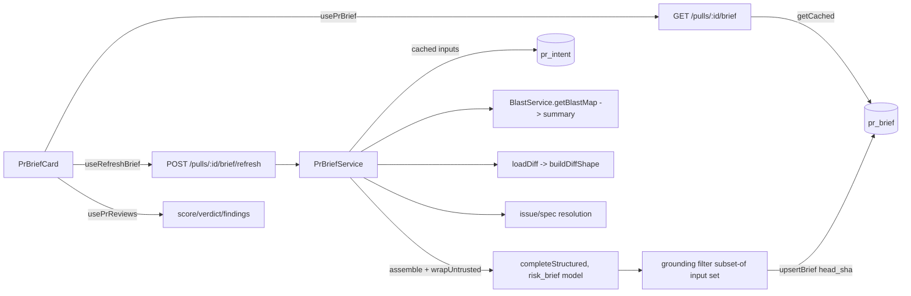

# PR Brief card — Development Plan (SPEC-cross-06)

Status: implemented. Derived from `specs/2026-08-27-pr-brief-card.md`, which is
the authority — if this plan and the spec disagree on *what* to build, the spec
wins; on *how*, this file wins. All 11 steps below were executed by `implementer`
on 2026-08-27; `plan-verifier` confirmed all 15 acceptance criteria met with zero
gaps; a follow-up `pr-self-review` pass found 0 CRITICAL findings. The spec's own
`Status:` was flipped to `shipped` by `doc-writer` in the same session.

## Objective

Ship the **PR Brief card** (SPEC-cross-06): a cached, one-LLM-call brief
`{ what, why, risk_level, risks[], review_focus[] }` shown at the top of the PR
Overview tab, with a cached-GET / forced-refresh split modeled on the shipped PR
Intent Layer, server-side grounding of all file/endpoint refs, SHA-pinned
clickable review-focus links, and a partial-inputs indicator. "Done" = AC-1
through AC-15 all covered by implemented, tested code.

## Requirements reviewed

- **Spec (source of truth):** `specs/2026-08-27-pr-brief-card.md` — read in
  full; 15 ACs, 9 edge cases, 4 resolved + 4 open questions.
- **Sibling spec precedent:** `specs/04-blast-radius.md` (the `PrBlastMap`-vs-
  `BlastRadius` naming-collision precedent the spec cites; same repurpose-vs-
  rename decision applies to `PrBrief`).
- **Contracts:** `server/src/vendor/shared/contracts/brief.ts` (the dead
  `PrBrief` `{ intent, blast, risks, history }` to repurpose — confirmed
  nothing imports it), `contracts/pr-blast.ts:43` (`PrBlastMap`, the
  blast-summary source), `contracts/platform.ts:15` (`FeatureModelId` enum —
  `risk_brief` key already exists).
- **Server precedent:** `intent-classifier.ts` + `intent-signals.ts` (the
  direct architectural model — service-does-I/O + `buildDiffShape` +
  `wrapUntrusted` + `readClonedSpec` traversal guard + `resolveFeatureModel`),
  `pulls/routes.ts:454-478` (the GET/refresh split), `reviews/repository/
  pull.repo.ts:61-89` (`upsertIntent`/`getIntent` — the persistence pattern
  for a new brief repo method), `blast/service.ts:29` (`getBlastMap`, produces
  the condensed map that feeds OQ-7's blast summary), `schema/reviews.ts:70`
  (dead `pr_brief` table).
- **Client precedent:** `hooks/reviews.ts:234-249` (`usePrIntent`/
  `useRefreshIntent`), `hooks/reviews.ts:53` (`usePrReviews` — score/verdict/
  findings source), `OverviewTab.tsx` (mount point above `s.panelGrid`),
  `IntentPanel` (staleness + refresh UI precedent), `github-urls.ts:24`
  (`githubBlobUrl`).
- **INSIGHTS:** root `INSIGHTS.md` (silent-truncation lesson the spec's EC-8
  "N of M" requirement is written against). Read root + `server/INSIGHTS.md` +
  `client/INSIGHTS.md` at execution time per root `CLAUDE.md`'s order.

## Scope & Modules

- **`@devdigest/shared`** (contract-first): repurpose `contracts/brief.ts`
  `PrBrief` to the new shape. No `FeatureModelId` enum change — the existing
  `risk_brief` key is reused.
- **server** (pnpm): add `head_sha` column to `pr_brief`; new
  `src/modules/pr-brief/` plugin (service + signals + repository, modeled on
  `intent-classifier`); two routes; register in `modules/index.ts`.
- **client** (pnpm): two hooks; `PrBriefCard` component + tests; mount in
  `OverviewTab.tsx`; `next-intl` message keys.
- **Out:** reviewer-core (unchanged — brief generation lives in server app
  layer, reusing the `completeStructured` port and `wrapUntrusted` which
  reviewer-core already exports), e2e (AC-9/AC-14 e2e flows deferred to CI).

## Architectural Constraints

- **Contract-first (root `CLAUDE.md`):** `contracts/brief.ts` changes in
  `server/src/vendor/shared/` **first**, then `scripts/check-contracts.sh
  --fix` propagates to `client/src/vendor/shared/`, then
  `scripts/check-contracts.sh` (no `--fix`) verifies. Server + client
  consumers edited only after this. No `FeatureModelId` enum widening needed
  (reuse `risk_brief`), so no ripple into `feature-models.ts` defaults.
- **Package manager:** server + client are **pnpm**. Never npm. Schema change
  via `cd server && pnpm db:generate` then `pnpm db:migrate` — never a
  hand-written migration (server `CLAUDE.md`).
- **Onion layering** (`onion-architecture` skill): the new `pr-brief/` module
  mirrors `IntentClassifier` — the service class holds all I/O (LLM, clone
  reads, GitHub, DB upsert); pure text-shaping (ref extraction, diff-shape,
  prompt build, **grounding filter**) lives in a sibling
  `pr-brief-signals.ts` with no I/O, exactly as `intent-signals.ts` splits
  from `intent-classifier.ts`. DB access goes through a repository method on
  `ReviewRepository` → `pull.repo.ts` (no Drizzle in the service). Routes are
  transport-only. The grounding filter (AC-7) must be a pure, deterministic
  function in the signals file so it is hermetically unit-testable.
- **`pr_brief` table** (`postgresql-table-design` skill): keep PK `prId`,
  `json jsonb` stores the serialized `PrBrief`; add **nullable `head_sha
  text`** mirroring `prIntent.headSha` (`schema/reviews.ts:63`). One row per
  PR, overwritten on regenerate (no per-SHA versioning table). Then
  `drizzle-orm-patterns` for the `upsertBrief`/`getBrief` repo methods
  (mirror `upsertIntent`/`getIntent` incl. `onConflictDoUpdate`).
- **Frontend placement** (`frontend-ui-architecture` skill): card is a
  colocated `_components/PrBriefCard/` folder with its own `*.test.tsx`
  (client `CLAUDE.md`); all data via hooks in `lib/hooks/`, never `fetch`;
  all copy via `next-intl`; `PrBrief` type imported from `@devdigest/shared`,
  not redeclared.
- **Hermetic vs `*.it.test.ts`** (server `CLAUDE.md`, `TESTING.md`): grounding
  filter, diff-shape, prompt/untrusted-wrapping, staleness comparison →
  hermetic (`pnpm exec vitest run --exclude '**/*.it.test.ts'`). Route
  round-trips that touch DB (AC-1, AC-2, AC-5, AC-11) → `*.it.test.ts`.
  Never `pnpm test` locally for `server/` (boots testcontainers).
- **Security:** reuse `wrapUntrusted` and the `intent-signals.ts` SYSTEM_PROMPT
  posture for AC-15; reuse `readClonedSpec`'s traversal guard
  (`intent-classifier.ts:169`); grounding is a server-side safety control
  before persist (AC-7); rate limit on refresh (AC-5); tenancy via
  `getContext` + `resolvePrAndRepo`.

### Data flow

## Execution Mode

**Multi-agent pipeline** (the default), run by `/run-plan`:
`implementer` executes the steps, then `plan-verifier` + `architecture-reviewer`
in parallel, then a follow-up `pr-self-review` pass. Steps are grouped by skill
set so `implementer` loads each authoring skill once; the contract-first
ordering is a hard dependency the implementer must not reorder.

## Steps

**Group A — shared contract (must run first; dependency wins over skill
grouping).**

1. Repurpose `PrBrief` in `contracts/brief.ts` to the spec's new shape:
   `RiskLevel = z.enum(['high','medium','low'])`, `BriefRisk { title,
   explanation, refs: string[] }`, `BriefFocusItem { ref, line:
   number|null, description }`, `PrBrief { what, why, risk_level, risks[],
   review_focus[], signals_used: string[], head_sha: string|null }`
   (`head_sha` `.nullish()` so pre-field rows parse — mirror `Intent.head_sha`).
   Delete the now-dead `BlastRadius`/`Risks`/`PrHistory`/`SmartDiff` blocks
   **only if** grep reconfirms zero importers. Keep `SmartDiff*` if
   still imported elsewhere. — files: `server/src/vendor/shared/contracts/
   brief.ts` — skills: [zod, semver-discipline] — tests:
   `scripts/check-contracts.sh` (expect it to fail until Step 2).
2. Propagate to the vendored copy and verify parity. — files:
   `client/src/vendor/shared/contracts/brief.ts` (generated) — skills: [zod]
   — tests: `scripts/check-contracts.sh --fix` then `scripts/check-
   contracts.sh` (must pass clean). Covers **AC-6**.

**Group B — server schema + persistence (onion + drizzle + postgres).**

3. Add nullable `headSha: text('head_sha')` to `prBrief` in
   `schema/reviews.ts:70`, mirroring `prIntent.headSha`. Generate + apply
   the migration. — files: `server/src/db/schema/reviews.ts` — skills:
   [postgresql-table-design, drizzle-orm-patterns] — tests: `cd server &&
   pnpm db:generate && pnpm db:migrate`, then `pnpm typecheck`. Supports
   **AC-3, AC-4**.
4. Add `upsertBrief(db, prId, brief)` + `getBrief(db, prId): Promise<PrBrief
   | undefined>` to `pull.repo.ts` (serialize/deserialize `json` + `head_sha`,
   `onConflictDoUpdate` on `prBrief.prId`), and expose them on
   `ReviewRepository` (`repository.ts`) exactly as `upsertIntent`/`getIntent`.
   — files: `server/src/modules/reviews/repository/pull.repo.ts`,
   `server/src/modules/reviews/repository.ts` — skills: [drizzle-orm-patterns]
   — tests: `cd server && pnpm typecheck`. Supports **AC-1, AC-2, AC-3**.

**Group C — server brief module: pure signals (onion — pure layer, no I/O).**

5. New `server/src/modules/pr-brief/pr-brief-signals.ts` (pure, mirrors
   `intent-signals.ts`): the model-output schema (`{ what, why, risk_level,
   risks, review_focus }` — deliberately **not** the full `PrBrief`, so
   `signals_used`/`head_sha` stay server-set); a `buildBriefPrompt` that
   `wrapUntrusted`-wraps PR title/body/issue/spec content with an
   ignore-instructions SYSTEM_PROMPT; a `buildBlastSummary(PrBlastMap)` that
   condenses to symbol/endpoint/cron labels + counts; and a pure
   `groundBrief(modelOutput, inputSet)` that drops any `risks[].refs`/
   `review_focus[].ref` not in the input set (union of diff-shape paths,
   blast-summary labels, resolved issue/spec labels). Reuse `buildDiffShape`,
   `extractSpecPaths`, `extractIssueRefs`, `extractUrls`, `MAX_REFS_PER_KIND`
   from `intent-signals.ts` (import, don't re-invent). — files:
   `server/src/modules/pr-brief/pr-brief-signals.ts` — skills:
   [onion-architecture, zod] — tests: `cd server && pnpm exec vitest run
   --exclude '**/*.it.test.ts'` (new `pr-brief-signals.test.ts`). Covers
   **AC-7** (grounding drops ungrounded refs), **AC-8** (diff shape only, no
   line content), **AC-15** (untrusted wrapping), **AC-10** (`risk_level`
   from the enum).

**Group D — server brief service + routes (onion service/transport + fastify).**

6. New `server/src/modules/pr-brief/service.ts` — `PrBriefService` mirroring
   `IntentClassifier`: `getCached(prId)` → repo `getBrief`; `generate(...)`
   assembling inputs — cached `pr_intent` (degrade if absent), blast summary
   via `container.blastService.getBlastMap` (degrade if degraded/absent),
   diff shape, resolved issue (`github().getIssue`) + specs
   (`readClonedSpec` — reuse the guard) — recording `signals_used` from
   which inputs were actually present, making **exactly one**
   `completeStructured` call with `resolveFeatureModel(container, workspaceId,
   'risk_brief')`, then `groundBrief`, then `upsertBrief` with
   `pull.headSha`. — files: `server/src/modules/pr-brief/service.ts` —
   skills: [onion-architecture] — tests: `cd server && pnpm exec vitest run
   --exclude '**/*.it.test.ts'`. Covers **AC-2** (one LLM call, persisted
   with head SHA), **AC-11** (partial intent/blast), **AC-12** (no
   issue/specs), **AC-13** (`signals_used`).
7. New `server/src/modules/pr-brief/routes.ts`: `GET /pulls/:id/brief`
   (`params: IdParams`, `response: PrBrief | null`, `getContext` +
   `resolvePrAndRepo`, returns `getCached ?? null`, no LLM); `POST
   /pulls/:id/brief/refresh` (`config: { rateLimit: { max: 10, timeWindow:
   '1 minute' } }`, `response: PrBrief`, loads diff via `loadDiff`, calls
   `service.generate`). Register the module in `server/src/modules/
   index.ts`. Staleness computed client-side (GET returns the stored brief
   with its `head_sha`; no server-side `stale` field). — files:
   `server/src/modules/pr-brief/routes.ts`, `server/src/modules/index.ts` —
   skills: [fastify-best-practices, onion-architecture] — tests: `cd server
   && pnpm typecheck` + hermetic run; DB round-trip route tests as
   `pr-brief.it.test.ts`. Covers **AC-1** (null, no LLM), **AC-5** (429 rate
   limit), and the transport half of **AC-2**. **AC-3/AC-4** satisfied
   structurally (GET returns stored `head_sha`; staleness compared
   client-side in Step 9).

**Group E — client hooks + card + mount (frontend-ui + react + next).**

8. Add `usePrBrief(prId)` (`GET`, `PrBrief | null`, mirrors `usePrIntent`)
   and `useRefreshBrief(prId)` (`POST .../brief/refresh`, mirrors
   `useRefreshIntent`) to `hooks/reviews.ts`. — files:
   `client/src/lib/hooks/reviews.ts` — skills: [react-best-practices] —
   tests: `cd client && pnpm typecheck`.
9. New `_components/PrBriefCard/` (`PrBriefCard.tsx` + `styles.ts` +
   `PrBriefCard.test.tsx`): renders the seven states from the spec's States
   section — no-brief (empty state + Generate control, **AC-14**), loading,
   complete, partial (signals-used indicator, **AC-13**), empty-
   `review_focus` (distinct — **EC-6**), stale (regenerate affordance when
   `brief.head_sha !== headSha`, **AC-4**), error (retry, card persists).
   Renders `risk_level` as text + one enum value (**AC-10**, accessible: not
   colour-only), a clickable keyboard-focusable `review_focus[]` list using
   `githubBlobUrl(repoFullName, brief.head_sha, item.ref, item.line)` —
   pinned to the **brief's** stored SHA, not `headSha` (**AC-9**), `risks[]`
   rendered independently of focus (**EC-9**), and score/verdict/findings-
   count from `usePrReviews` — display-only, not from the brief. No silent
   cap on rendered lists — "N of M" affordance (**EC-8**); no silent text
   clip (**EC-7**). All copy via `next-intl`. — files:
   `client/src/app/repos/[repoId]/pulls/[number]/_components/PrBriefCard/
   PrBriefCard.tsx`, `.../styles.ts`, `.../PrBriefCard.test.tsx` — skills:
   [frontend-ui-architecture, react-best-practices, react-testing-library]
   — tests: `cd client && pnpm test`. Covers **AC-9, AC-10, AC-13, AC-14**
   and EC-6/EC-7/EC-8/EC-9.
10. Add `next-intl` message keys for the card to `client/messages/<locale>/
    *.json`. — files: `client/messages/en/*.json` — skills:
    [frontend-ui-architecture] — tests: `cd client && pnpm typecheck &&
    pnpm test`.
11. Mount `PrBriefCard` in `OverviewTab.tsx` **above** the `s.panelGrid`
    div, wiring `usePrBrief`/`useRefreshBrief` and threading
    `headSha`/`repoFullName`. — files: `client/src/app/repos/[repoId]/
    pulls/[number]/_components/OverviewTab/OverviewTab.tsx` — skills:
    [frontend-ui-architecture, react-best-practices, next-best-practices] —
    tests: `cd client && pnpm build && pnpm test`.

## Step groups by skill set

- **Steps 1–2** (shared contract): `zod`, `semver-discipline` — one load.
  Ordered first by contract-first dependency.
- **Steps 3–4** (server schema/persistence): `postgresql-table-design`,
  `drizzle-orm-patterns` — one load.
- **Steps 5–7** (server module): `onion-architecture`, `zod` (already
  loaded), `fastify-best-practices` — one load each.
- **Steps 8–11** (client): `frontend-ui-architecture`, `react-best-practices`,
  `react-testing-library`, `next-best-practices` — one load each.

## Skills to apply

- Step 1: `zod`, `semver-discipline`
- Step 2: `zod`
- Step 3: `postgresql-table-design`, `drizzle-orm-patterns`
- Step 4: `drizzle-orm-patterns`
- Step 5: `onion-architecture`, `zod`
- Step 6: `onion-architecture`
- Step 7: `fastify-best-practices`, `onion-architecture`
- Step 8: `react-best-practices`
- Step 9: `frontend-ui-architecture`, `react-best-practices`,
  `react-testing-library`
- Step 10: `frontend-ui-architecture`
- Step 11: `frontend-ui-architecture`, `react-best-practices`,
  `next-best-practices`

`semver-discipline` is a change-impact skill, assigned only to Step 1 because
it repurposes/deletes existing exported contract symbols. Review-only skills
(`security`, `typescript-expert`, `pr-self-review`) are not assigned to
steps — they run over the finished diff at the pre-PR gate instead.

## Recommendations

- **Reuse `risk_brief` feature-model key, do not add a new enum value.**
  `contracts/platform.ts:60` already ships `risk_brief` ("Assesses merge
  risks for a pull request") with no consumer wired — it fits this feature
  semantically and avoids a `FeatureModelId` enum change.
- **Derive the blast summary from the existing `BlastService.getBlastMap`,
  don't re-query repo-intel.** It already produces the condensed
  `PrBlastMap` the card's sibling Blast panel uses.
- **Keep staleness client-side (AC-3/AC-4)**, mirroring `IntentPanel`'s
  `intent.head_sha != null && intent.head_sha !== headSha`. Keeps the
  `PrBrief` response equal to the contract.
- **Do not delete the `SmartDiff*` exports from `brief.ts`** without a grep
  — the barrel/`useSmartDiff` path may still import them.

## Out of scope

- Spec authoring or spec status changes (owned by `doc-writer` after ship).
- Architecture/security review — handled by `architecture-reviewer` +
  `pr-self-review`, not this plan.
- Integration/e2e tests deferred to CI: the `*.it.test.ts` route round-trips
  (AC-1, AC-2, AC-5, AC-11 DB path) and the e2e flows (**AC-9** click-through,
  **AC-14** empty-state journey) are written but run in CI, not locally.
- Reviewer-core changes, a standalone Brief tab/route, generating
  score/verdict/cost/tokens in the Brief call (spec Non-goals), per-SHA
  brief history table.

## Verification

- Contract parity: `scripts/check-contracts.sh` passes clean after Step 2.
- Server: `cd server && pnpm typecheck` and `pnpm exec vitest run --exclude
  '**/*.it.test.ts'` (hermetic: grounding AC-7, diff-shape AC-8, untrusted
  AC-15, risk_level AC-10, service degrade paths).
- Client: `cd client && pnpm typecheck && pnpm test && pnpm build`.
- Deferred to CI: `pnpm exec vitest run .it.test` (AC-1/AC-2/AC-5/AC-11),
  `cd e2e && npm run e2e:hermetic` (AC-9/AC-14 flows).
- AC coverage cross-check: every AC-1…AC-15 maps to a step above (AC-1→7,
  AC-2→6/7, AC-3/4→3/9, AC-5→7, AC-6→1/2, AC-7→5, AC-8→5, AC-9→9, AC-10→5/9,
  AC-11→6, AC-12→6, AC-13→6/9, AC-14→9, AC-15→5).

## Open questions / assumptions (at plan time)

- **OQ-3 (list caps), OQ-4 (overflow), OQ-5 (implicit generation), OQ-7
  (blast summary shape):** used the spec's provisional defaults — no server
  list cap + top-N `review_focus` with "N of M" (OQ-3); wrap/clamp-with-
  expand (OQ-4); generate only on explicit control, no implicit generation
  on first review (OQ-5); blast summary = condensed `PrBlastMap`
  symbols/endpoints/crons/counts (OQ-7). **Resolved in implementation:**
  `REVIEW_FOCUS_DISPLAY_CAP = 5` (OQ-3), `WHAT_WHY_CLAMP_CHARS = 220` (OQ-4)
  — see `specs/2026-08-27-pr-brief-card.md`'s Open questions section for the
  current, post-ship status of all four.
- **`test-writer` was off by default in `/run-plan`.** The DB-backed
  AC-1/AC-2/AC-5/AC-11 `.it.test.ts` and the AC-9/AC-14 e2e flows were the
  ACs whose verification hint is a test that was not auto-written by a
  dedicated test-authoring pass; `implementer` wrote the hermetic unit tests
  inline per step instead. `plan-verifier` judged AC-9/AC-14 against code +
  the implementer's own RTL tests and found both met.
- **Assumption confirmed at implementation time:** `BlastService` is not
  exposed on the DI container — `PrBriefService` instantiates it directly
  (`new BlastService(container)`), matching the existing precedent in
  `blast/routes.ts`. A follow-up `pr-self-review` pass flagged this as a
  `WARNING` (onion-architecture lens), disagreeing with the wave-1
  `architecture-reviewer`'s assessment that the pattern was acceptable —
  unresolved judgment call, not blocking, see
  `.claude/pr-review/dfa905a545594035a68f8a88dd696590ed1a1b98.json`.
