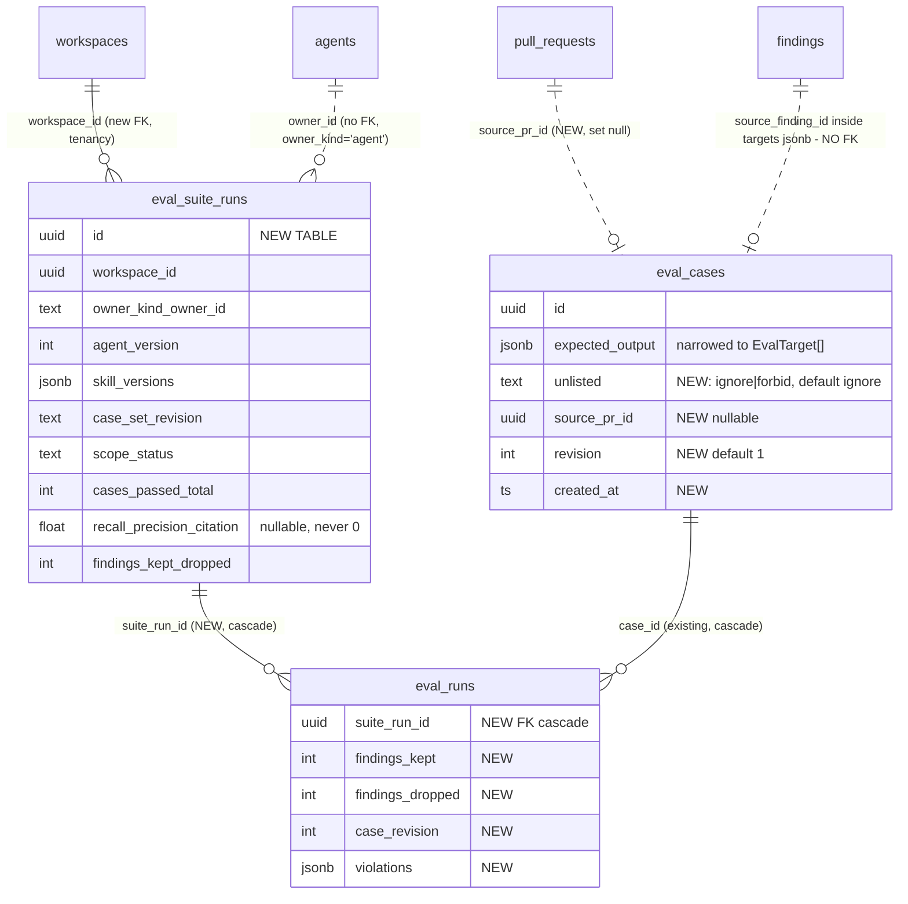
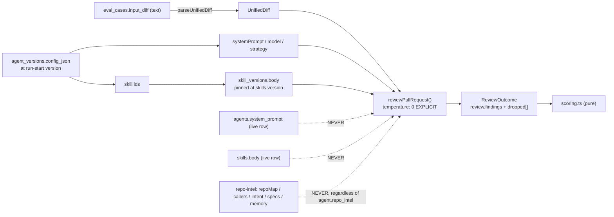

# Eval Pipeline — Implementation Plan

**Source spec:** `specs/2026-08-29-eval-pipeline.md`
**Status:** draft plan, not yet executed

## Objective

Ship the Eval Pipeline described in `specs/2026-08-29-eval-pipeline.md`: a code-only
(no model-judged) regression harness that turns accepted/dismissed findings into
replayable eval cases, replays them against a **frozen** agent configuration, and
reports recall / precision / citation_accuracy per set-run with a comparability
check. Done = the spec's 5 phases land, each independently shippable, and all 18
acceptance criteria are satisfied.

## Requirements reviewed

Per `CLAUDE.md`'s "Before answering" order:

- **`specs/`** — `specs/2026-08-29-eval-pipeline.md` (read in full; it is the
  requirement). Sibling plan/verification artifacts exist for prior features
  (`specs/2026-08-27-pr-brief-card-plan.md`, `…-verification.md`) — that is the
  shape this plan slots into. No eval-specific spec besides this one.
- **`docs/`** — `docs/` holds only `agent-prompts/` and `skills/`; nothing
  eval-related. `server/docs/api-contracts.md` is the contract-first checklist for
  the new routes. `TESTING.md` §"Running locally" holds the hermetic/`.it.test.ts`
  split.
- **`INSIGHTS.md`** — three entries are directly load-bearing and are cited on the
  steps below:
  - Root `INSIGHTS.md` *What Doesn't Work*, 2026-08-29 — `citation_accuracy` is not
    recomputable from the DB; read kept/dropped off `ReviewOutcome`;
    `FULL_FILE_KINDS` inflates the number and must be disclosed. (= criteria 14, 15.)
  - Root `INSIGHTS.md` *What Works*, 2026-08-14 — A/B needs repeats; the two
    conditions must run against the same PR row or repo-intel silently confounds
    them. (= the freeze, and Phase 5's `--runs 5`.)
  - `client/INSIGHTS.md`, 2026-08-14 — `vendor/ui/nav.ts` is the **sole** nav
    registration point; `Sidebar.tsx` imports `NAV` directly with no prop-based
    extension. Precedent: `LAB_L02` added the "SKILLS LAB" section there. (= the
    do-not-touch exception, Step 23.)
  - Root `INSIGHTS.md` *Decisions*, 2026-07-31 — "Standalone packages instead of a
    workspace" is why `@devdigest/shared` is vendored twice and why
    `scripts/check-contracts.sh` exists.

**Discovered while grounding, not stated in the spec** (all folded into steps below):

- `client/messages/en/eval.json` **already exists** with `dashboard`, `caseEditor`,
  `evalsTab` and `page` namespaces, and `client/messages/en/agents.json:51` already
  has `editor.tabs.evals: "Evals"`. Phase 3/4 add keys, they do not create the file
  or the tab label.
- `client/src/app/skills/.../EvalsTab/EvalsTab.tsx` is the skill-side placeholder the
  spec says must stay untouched (skill evals are out of scope) — the agent-side tab
  is a **new, differently-located** component.
- `diffFromPrFiles()` (`server/src/modules/reviews/diff-loader.ts:32`) returns a
  parsed `UnifiedDiff`, not the text. Case creation needs the **text**. See Step 8.

## Scope & Modules

| Module | Touched | Why |
| --- | --- | --- |
| `server/` | **yes** | Contracts (canonical copy), `eval` schema + migration, new `src/modules/evals/`, boot reaper entry, experiment script |
| `client/` | **yes** | Evals tab, `/eval` dashboard + compare, FindingCard action, hooks, nav entry, i18n keys, vendored contract sync |
| `reviewer-core/` | **no** | `reviewPullRequest`, `groundFindings`, `parseUnifiedDiff` are **called, not modified** (spec, Packages touched). No step edits it. |
| `e2e/`, `mcp-server/`, `evals/` (repo root) | **no** | `evals/` at repo root is a *different product* (spec §Naming). Nothing may import from it. |

## Architectural Constraints

**Contract-first sequencing (root `CLAUDE.md`).** `server/src/vendor/shared/` is
canonical. Every phase that changes a contract does: edit server copy →
`./scripts/check-contracts.sh --fix` → `cd client && pnpm typecheck`. The
`**/src/vendor/**` do-not-touch rule carries an explicit carve-out for
`vendor/shared` "as part of a deliberate contract change" — this is one.

**The `vendor/ui/nav.ts` exception — granted explicitly.** Root `CLAUDE.md` lists
`**/src/vendor/**` as do-not-touch with a carve-out only for `vendor/shared`. Step 23
edits `client/src/vendor/ui/nav.ts` anyway, and **the spec authorises it** (spec
§Client: *"This needs an explicit exception"*). It is not a judgement call for the
implementer: `client/INSIGHTS.md` (2026-08-14) records that `Sidebar.tsx` imports
`NAV` directly with no prop-based extension point, and that `LAB_L02` set the
precedent by adding the "SKILLS LAB" section the same way. Edit `NAV` only — add one
item to a new or existing group. Do not restructure the file, and do not treat this
as licence for any other `vendor/ui/` file.

**Package managers.** `server/` and `client/` are **pnpm**. No step touches
`reviewer-core/`, `e2e/` or `mcp-server/`, so **npm is never invoked in this plan**.
Any step that seems to need `npm` is a mis-scoped step.

**Hermetic vs `*.it.test.ts` (`TESTING.md`, `server/CLAUDE.md`).** Local server test
command is `pnpm exec vitest run --exclude '**/*.it.test.ts'` — **never** `pnpm test`,
which boots testcontainers Postgres. Route and reaper coverage is `*.it.test.ts` and
is **deferred to CI**. `scoring.ts` and `executor.ts` (with `MockLLMProvider`) are
hermetic by construction.

**Onion layering**
(`.claude/skills/onion-architecture/references/server-module-pattern.md`). New
`server/src/modules/evals/` follows routes → service → repository: `routes.ts`
declares Zod schemas from `@devdigest/shared` and holds no Drizzle; `repository.ts` is
the only file importing `db/schema.ts`; `service.ts` builds its own repository from
`container.db` (sanctioned) but reaches `agents`/`skills`/`reviews` data **through the
container** (`container.agentsRepo`, `container.reviewRepo`), never by importing
another module's repository. `scoring.ts` is pure — no DB, no LLM, no imports from
`platform/`.

**Do not reuse `ReviewRunExecutor`** (spec §Where the code goes).
`server/src/modules/reviews/run-executor.ts` persists `reviews`/`findings`, creates
`agent_runs`, and rebuilds repo-intel at `:223`. An eval run must do none of these.
The only shared surface is the plain function `reviewPullRequest`.

**Migrations.** Edit `server/src/db/schema/eval.ts`, then `pnpm db:generate` →
`pnpm db:migrate`. **Never hand-write migration SQL** (`server/CLAUDE.md`). Migrations
do not run on boot.

**Postgres shape** (from `postgresql-table-design`, reconciled with the existing house
style in `server/src/db/schema/`): the repo uses `uuid ... defaultRandom()` PKs and
`timestamptz` throughout, so `eval_suite_runs` matches that rather than the skill's
`BIGINT IDENTITY` default — consistency with 20 existing tables wins. Postgres does
**not** auto-index FK columns: add explicit indexes on `eval_suite_runs.workspace_id`,
`eval_suite_runs.owner_id`, `eval_runs.suite_run_id`, and `eval_cases.source_pr_id` —
the dashboard queries filter on exactly these. `status` and `scope` follow the existing
`text(..., { enum: [...] })` pattern (`agents.strategy`, `eval_cases.owner_kind`), not
a PG `CREATE TYPE` enum, because both are business-evolving sets. Money-ish `cost_usd`
stays `doublePrecision` to match `agent_runs.cost_usd` and `eval_runs.cost_usd`.



**The one structural gap the spec leaves implicit — flagged here, handled in Step 9.**
`source_finding_id` lives *inside* the `expected_output` jsonb (on each `EvalTarget`),
so **no foreign key can null it** when the finding is deleted. Acceptance criterion 12
requires it to read as null anyway. See Recommendations for the resolution baked into
Step 9; do not let an implementer discover this at test time.

The freeze that criteria 8/9/10/13 test:



## Design reconciliation — three artifacts, three iterations

**`client/messages/en/eval.json` is a third design artifact and it is neither of the
other two.** Root `INSIGHTS.md` (Codebase Patterns, 2026-08-14) calls the i18n file
"the closest thing to a spec for the intended UI" — read it before building any
screen here. Dumping its keys settles several of the plan's gaps and opens two more:

- **It confirms**, against the plan's earlier omissions: `evalsTab.metricsTitle` /
  `metricsSubtitle` (the EVAL METRICS block), `evalsTab.neverRun` (the third case
  state), `evalsTab.run`/`edit`/`delete` (the hover icon buttons),
  `caseEditor.validJson`/`invalidJson` (the validity badge),
  `caseEditor.lastRunPassed`/`lastRunFailed`/`resultSummary` (the last-run strip),
  `dashboard.configure` = `'Configure eval cases →'`.
- **It contradicts the HTML mockup** on the case editor's Input tabs: it declares
  **only** `caseEditor.tabs.diff` and `caseEditor.tabs.prMeta` — no `files` key —
  while the mockup's `EvalCaseEditor` renders three. See step 20(c).
- **It contradicts both of them on the last-run strip's wording**: the key is
  `'recall {recall}% · precision {precision}% · citation {citation}% · {duration}s'`
  — three metrics and no cost — where mockup and screenshot both read
  `expected 1 finding, got 1 · 1.8s · $0.02`. Prefer the i18n's metric-shaped
  version: it is the one that survives the move from "expected N findings" to
  targets (spec gap 2), and cost already has a home in the run history.
- **It has no key at all** for: `Run on save`, `Finding skeleton`, the compare view,
  the regression alert banner, the all-agents index, or `Run all agents` — i.e. it
  was written for a **single-level** dashboard, like the HTML mockup.
- **It adds one surface nobody else shows**: `caseEditor.preview` = `'Preview'`.

So the three artifacts stack in this order, oldest to newest: **i18n ≈ HTML mockup →
screenshots**. Where they disagree, the screenshots win *on scope* (they are the
newest and show the most), and the i18n wins *on wording*. Keys the screenshots need
and the i18n lacks are additions, per Recommendation 6.

The HTML bundle is gzip+base64; unpacking it yields `screen_agents.jsx` (Evals tab),
`screen_cizruns.jsx` (`EvalCaseEditor` modal), `screen_skills.jsx` (`ScreenEval`
dashboard), `data.jsx` (`window.EVAL`) and `data2.jsx` (`EVAL_CASES`). That bundle is
**older** than the screenshots: its dashboard is *skill*-scoped ("Reviewer skill
`pr-quality-rubric` · 20-trace gold set"), its agent-editor tabs are
`["Config","Skills","Evals","Stats","CI"]` with no `Context`, and it has no
all-agents index, no Compare modal, no run-selection checkboxes, no "Run all agents",
no "Promote v7" and no "Turn into eval case". All of those appear only in the
screenshots.

**The starter's contracts already cover more of this UI than the spec inventories.**
Per the root `INSIGHTS.md` "inventory what the starter already wired" pattern, a
second pass over `contracts/eval-ci.ts` and `db/schema/eval.ts` found five surfaces
that need **no new field** and that the plan previously omitted:

| Screen element | Already shipped as |
| --- | --- |
| Regression banner — *"Precision dipped 2pts on v7…"* | `EvalDashboard.alert: z.string().nullable()` (`eval-ci.ts:88`) |
| Tile deltas — `▲4pt` / `▼2pt` / `▲1pt` | `EvalDashboard.delta` (`eval-ci.ts:80`) |
| `TRACES PASSED 17/20` tile | `EvalDashboard.current.traces_passed/_total` (`:73`) |
| Case-editor **Files** tab (mockup only) | `eval_cases.input_files` jsonb (`schema/eval.ts:16`) |
| `Last run passed · 1.8s · $0.02` | `eval_runs.duration_ms` + `cost_usd` (`schema/eval.ts:32`) |

**Deliberate divergences from the mockup, all spec-driven — do not "fix" them back:**

- **Expected output is `EvalTarget[]`, not the mockup's bare finding JSON.** The
  mockup's `EXPECTED` literal carries `severity`/`category`/`title`/`file`/
  `start_line` and no `kind` and no `end_line`. Spec gap 2 supersedes it.
- **The `TRACES PASSED` tile is relabelled `CASES PASSED`.** Spec gap 1 is
  precisely that "17 of what?" is unanswerable while the unit is a trace.
- **No "Promote v7" button** in Compare, though the mockup has one — out of scope,
  and no restore-a-version route exists.
- **"Turn into eval case" is disabled until the finding is decided**, though the
  screenshot shows it enabled on an undecided finding. Criterion 3 governs.

## Execution Mode

**Multi-agent pipeline** (the default), run by `/run-plan`
(`.claude/skills/run-plan/SKILL.md`): `implementer` → `plan-verifier` ∥
`architecture-reviewer` → fix loop. Implication for the steps below: each phase is a
natural `/run-plan` invocation boundary — the spec requires each phase to ship and
review independently, so run the pipeline **once per phase** rather than once for all
27 steps, otherwise the reviewers see a diff spanning schema, executor and two UI
surfaces at once. `test-writer` is off by default: the test files named in the steps
below are the **implementer's** deliverable, not a separate agent's.

## Steps

Ordered so steps sharing a skill set are contiguous. Where a dependency forces a
different order it is called out on the step.

### Phase 1 — Schema + scoring (ships alone; no routes, no UI)

1. **Add the new contract file.** Create `EvalExpectationKind`, `EvalTarget`,
   `EvalUnlistedPolicy`, `EvalSuiteRunStatus`, `EvalRunScope`, `EvalRunInputs`,
   `EvalSuiteRun`, `EvalViolation` exactly as the spec's §Contract changes block
   defines them. Import `Severity`, `FindingCategory`, `Finding` from `./findings.js`
   and `EvalOwnerKind` from `./knowledge.js`. Add
   `export * from './contracts/eval-run.js';` to the barrel.
   — files: `server/src/vendor/shared/contracts/eval-run.ts` (new),
   `server/src/vendor/shared/index.ts`
   — skills: [zod]
   — tests: `cd server && pnpm typecheck`

2. **Amend the two existing contract files.** `knowledge.ts`: `EvalCase` gains
   `targets: z.array(EvalTarget)`, `unlisted: EvalUnlistedPolicy`,
   `source_pr_id: z.string().nullable()`, `revision: z.number().int()`,
   `created_at: z.string()`; **no** case-level expectation kind, **no** case-level
   `source_finding_id`. Leave `EvalRun` (`knowledge.ts:58`) untouched — the spec
   forbids widening it. `eval-ci.ts`: `EvalRunRecord` gains `suite_run_id`,
   `findings_kept`, `findings_dropped`, `case_revision`,
   `violations: z.array(EvalViolation)`, `missed: z.array(EvalTarget)`;
   `EvalDashboard.recent_runs` changes element type `EvalRunRecord` → `EvalSuiteRun`;
   `EvalCaseInput` replaces `expected_output: z.unknown()` with `targets` +
   `unlisted`. **This is a breaking change to shipped exported schemas**
   (`EvalDashboard`, `EvalCase`, `EvalRunRecord`, `EvalCaseInput`) — grep confirms
   zero current consumers outside the two vendored copies, but the surfaces exist.
   **`EvalRunResult` is marked `@deprecated`, not deleted** (Decision C): JSDoc
   pointing at `EvalSuiteRun` + `EvalRunRecord`, removal trigger "when Phase 4 ships
   and nothing references it". Also widen `EvalTrendPoint.*` (`eval-ci.ts:57`) and
   `EvalDashboard.current.*` (`:72`) to nullable — see Recommendation 2; a
   negative-control-only set otherwise fails serialization or coerces to `0`.
   **Keep `EvalDashboard.alert`, `.delta` and `EvalTrendPoint.pass_rate` as they
   are** — they already back the regression banner, the tile deltas and the pass
   column (see *Design reconciliation*); nothing new is needed for those. Rename
   `current.traces_passed`/`traces_total` → `cases_passed`/`cases_total` to match
   the unit the rest of the feature counts in.
   — files: `server/src/vendor/shared/contracts/knowledge.ts`,
   `server/src/vendor/shared/contracts/eval-ci.ts`
   — skills: [zod, response-schema, semver-discipline, deprecation-policy]
   — tests: `cd server && pnpm typecheck`

3. **Sync the vendored copy.** Run `./scripts/check-contracts.sh --fix` (server →
   client), then typecheck the client. Nothing is hand-edited under
   `client/src/vendor/shared/`.
   — files: `client/src/vendor/shared/**` (generated by the script — do not hand-edit)
   — skills: [none — this step runs a script and edits no source]
   — tests: `./scripts/check-contracts.sh && cd client && pnpm typecheck`

4. **Schema edit.** `eval_suite_runs` (new table, all `EvalSuiteRun` fields +
   `workspace_id` FK cascade; `agent_version` int, `skill_versions` jsonb and
   `case_set_revision` text carrying `EvalRunInputs` flattened; `scope` and `status`
   as `text(..., { enum })`). `eval_runs` gains `suite_run_id` (FK →
   `eval_suite_runs`, `on delete cascade`), `findings_kept`, `findings_dropped`,
   `case_revision`, `violations` jsonb. `eval_cases` gains `unlisted` (text enum, not
   null, default `'ignore'`), `source_pr_id` (FK → `pull_requests`, **`on delete set
   null`**), `revision` (int not null default 1), `created_at` (use the existing
   `now()` helper from `./_shared`). Add the four FK indexes listed under
   Architectural Constraints. Keep `expected_output`, narrow its meaning to
   `EvalTarget[]`; add **no** `expectation_kind` column.
   — files: `server/src/db/schema/eval.ts`
   — skills: [drizzle-orm-patterns, postgresql-table-design]
   — tests: `cd server && pnpm typecheck`

5. **Generate and apply the migration.** `cd server && pnpm db:generate` then
   `pnpm db:migrate`. Review the generated SQL for the `on delete set null` and the
   indexes; if wrong, fix the **schema** and regenerate. Never hand-edit the SQL file.
   — files: `server/drizzle/` (generated), `server/src/db/schema/eval.ts` (only if
   regeneration is needed)
   — skills: [drizzle-orm-patterns]
   — tests: `cd server && pnpm db:migrate && pnpm typecheck`

6. **The scorer — pure, no DB, no LLM.** Implement the spec's §Scoring rules
   verbatim: file-equality + inclusive non-empty line-range intersection as the *only*
   match rule; `title`/`severity`/`category` **never** matched on; resolve each finding
   against at most one target with `must_not_flag` winning; `TP`/`FP` counted in
   findings, `FN`/recall counted over targets;
   `citation_accuracy = Σkept / Σ(kept+dropped)`; a case passes when every `must_find`
   target matched **and** zero FP; **empty denominators return `null`, never `0`**.
   Exports pure functions only — this file must import nothing from `platform/`,
   `db/`, or `reviewer-core/` beyond types.
   — files: `server/src/modules/evals/scoring.ts` (new)
   — skills: [onion-architecture]
   — tests: `cd server && pnpm exec vitest run --exclude '**/*.it.test.ts'`

7. **Scorer tests — the spec's Phase-1 matrix, in full.** Hermetic, colocated. Cover:
   overlap boundaries (touching, adjacent-by-one, fully contained, identical); empty
   denominators → `null` for each of recall / precision / citation_accuracy; one case
   holding a `must_find` and a `must_not_flag` target simultaneously; a finding
   overlapping both kinds resolving to the `must_not_flag`; `unlisted: 'forbid'` with
   zero targets (negative control) and with `must_find` targets (strict mode); extras
   under `'ignore'` **not** counting as FP; one finding spanning three `must_find`
   targets counting as **one** TP. **This step is not optional and not deferrable** —
   `/run-plan` skips `test-writer`, and this is the file every number on every screen
   trusts.
   — files: `server/src/modules/evals/scoring.test.ts` (new)
   — skills: [onion-architecture]
   — tests: `cd server && pnpm exec vitest run --exclude '**/*.it.test.ts'`

### Phase 2 — Case creation + run (server; ships alone, exercised via HTTP)

8. **Extract the PR-diff *text* assembler.** `diffFromPrFiles()`
   (`server/src/modules/reviews/diff-loader.ts:32`) returns a parsed `UnifiedDiff`;
   case creation needs the joined **text** to store in `eval_cases.input_diff`. Export
   a new `prFilesToDiffText(repo, prId): Promise<string>` holding the existing
   `diff --git` / `---` / `+++` / patch join, and make `diffFromPrFiles`
   `return parseUnifiedDiff(await prFilesToDiffText(...))`. Behaviour-identical
   refactor; the evals service consumes it through `container.reviewRepo`, not by
   importing `reviews/repository.ts`. *(Dependency order: this precedes the drizzle
   steps because the evals service needs it — it is a one-function change and does not
   fragment the skill grouping.)*
   — files: `server/src/modules/reviews/diff-loader.ts`
   — skills: [onion-architecture]
   — tests: `cd server && pnpm exec vitest run --exclude '**/*.it.test.ts'`

9. **Eval repository.** Drizzle access to `eval_cases`, `eval_runs`,
   `eval_suite_runs` **only**. Includes: case CRUD, find-case-by-
   `(owner_id, source_pr_id)` for the fold rule, target-carries-`source_finding_id`
   lookup for idempotency, suite-run insert/patch, per-case row insert, dashboard
   aggregate queries filtered to `scope = 'suite'`, and `reapStaleSuiteRuns()`
   mirroring `reapStaleRunningRuns()` (`server/src/modules/reviews/service.ts:106`).
   **Resolve `source_finding_id` on read**: left-join `findings` and emit `null` for
   any target whose finding no longer exists — this is what satisfies criterion 12,
   because a jsonb-embedded id cannot carry an FK. Shape queries here; do **not** apply
   thresholds or eligibility rules (those are `service.ts`).
   — files: `server/src/modules/evals/repository.ts` (new)
   — skills: [drizzle-orm-patterns]
   — tests: `cd server && pnpm typecheck`

10. **The replay executor — this is gap 5's fix and criteria 8/10/13/14 live here.**
    New class, **not** a reuse of `ReviewRunExecutor`. Contract, exactly per spec
    §Where the code goes: `diff` = `parseUnifiedDiff(case.input_diff)` and nothing
    else; `systemPrompt`/`model`/`strategy` from `agent_versions.config_json` for the
    version being run, **never the live `agents` row**; skill bodies resolved from
    `skill_versions` at the skill's `skills.version` as of run start, **never
    `skills.body`**, with the `(skill_id, version)` pairs recorded on the run;
    `repoMap`/`callers`/`intent`/`specs`/`memory` **not supplied, unconditionally,
    regardless of `agent.repo_intel`**; `prDescription`/`task` only from
    `case.input_meta`; `temperature` **pinned to 0 explicitly and recorded** (do not
    inherit the provider default — `reviewer-core/src/llm/openai.ts:74` and
    `anthropic.ts:72` both default to `?? 0.2`; only `openrouter.ts:72` is 0). Read
    `findings_kept` / `findings_dropped` off `ReviewOutcome` (`review.findings.length`
    and `dropped.length`) as **integers**; never parse `ReviewOutcome.grounding` or
    `agent_runs.grounding` (root `INSIGHTS.md`, *What Doesn't Work*, 2026-08-29).
    Stream progress over `container.runBus`. Creates **no** `reviews`, `findings` or
    `agent_runs` rows.
    — files: `server/src/modules/evals/executor.ts` (new)
    — skills: [onion-architecture]
    — tests: `cd server && pnpm exec vitest run --exclude '**/*.it.test.ts'`

11. **Eval service.** (a) **Case creation from a finding**, deriving in the spec's
    order: kind from `accepted_at` → `must_find` / `dismissed_at` → `must_not_flag`,
    neither → 422; target from the finding's `file`/`start_line`/`end_line` +
    `source_finding_id`; owner from `reviews.agent_id` via `findings.review_id`;
    **fold into an existing case when `source_pr_id` matches**, appending the target
    and bumping `revision`, else create; `input_diff` = the **whole PR diff** via
    `prFilesToDiffText` (Step 8), never a trimmed hunk; idempotent — an existing target
    carrying this `source_finding_id` returns that case with **200**, no duplicate
    target, no revision bump. (b) **`isMeasurementChange(existing, patch)`** — a
    predicate copying the *shape* of `isConfigChange`
    (`server/src/modules/agents/helpers.ts:70`) but **not its field list**: bump
    `revision` only on `input_diff`, `targets` or `unlisted`; a rename or a notes edit
    must not. (c) **Run orchestration** — compute `case_set_revision` as a fingerprint
    over the set's `(case_id, revision)` pairs, insert the `eval_suite_runs` row as
    `running`, return, execute in the background, score via `scoring.ts`, patch the
    row. (d) **Dashboard aggregation**, filtering `scope = 'suite'` so single-case
    debug runs never enter trends or aggregates. Cross-module reads (`agentsRepo`,
    `skillsRepo`, `reviewRepo`) go through `container`. (e) **Cost control**
    (Decision B): a constant + queue capping concurrent suite runs, **and** a per-run
    USD ceiling that **aborts** — the executor accumulates `costUsd` off each
    `ReviewOutcome` and, on breach, stops the loop, marks the suite run `failed` with
    an explicit `error`, and keeps the per-case rows already scored. Partial results
    stay readable; the run is not silently reported as a complete set.
    — files: `server/src/modules/evals/service.ts` (new),
    `server/src/modules/evals/helpers.ts` (new — `isMeasurementChange`,
    `caseSetRevision`)
    — skills: [onion-architecture]
    — tests: `cd server && pnpm exec vitest run --exclude '**/*.it.test.ts'`

12. **Helper tests.** Hermetic unit tests for `isMeasurementChange` (targets edit
    bumps, `input_diff` edit bumps, `unlisted` edit bumps, name/notes edit does
    **not**) and `caseSetRevision` (stable under reordering, changes when any case's
    `revision` changes). These are the pure half of criterion 11.
    — files: `server/src/modules/evals/helpers.test.ts` (new)
    — skills: [onion-architecture]
    — tests: `cd server && pnpm exec vitest run --exclude '**/*.it.test.ts'`

13. **Executor hermetic test with `MockLLMProvider`.** Drive `executor.ts` with
    `MockLLMProvider` (`server/src/adapters/mocks.ts:68`, used the same way at
    `reviewer-core/test/run.test.ts:14`). Assert criterion 8 directly: two runs at the
    same agent version over the same cases produce **identical** `recall`/`precision`.
    Assert the freeze: with `agent.repo_intel = true`, the assembled prompt carries no
    `repoMap`/`callers` section. Assert `temperature: 0` reached the provider.
    — files: `server/src/modules/evals/executor.test.ts` (new)
    — skills: [onion-architecture]
    — tests: `cd server && pnpm exec vitest run --exclude '**/*.it.test.ts'`

14. **Routes.** All nine routes from the spec's §Routes table, declaring Zod
    `params`/`body`/`response` from `@devdigest/shared` via
    `fastify-type-provider-zod` — never `Schema.parse(req.body)` in a handler
    (`server/CLAUDE.md`). `getContext(container, req)` for tenancy on every route.
    `POST /agents/:id/eval-runs` returns **202 `{ run_id }`** and executes in the
    background, mirroring `POST /pulls/:id/review`
    (`server/src/modules/reviews/routes.ts:29`). `GET /eval-runs/:id/events` mirrors
    the SSE handler at `reviews/routes.ts:49` — `config: { rateLimit: false }`,
    replay-buffer-first off `container.runBus`. `POST /findings/:id/eval-case` returns
    201 on create, **200** on the idempotent hit, **422** on an undecided finding.
    Per-route rate limit on the two run-triggering routes (they fan out to paid model
    calls), matching the `max: 10, timeWindow: '1 minute'` precedent. **No compare
    route** — the compare view uses `GET /eval-runs/:id` + the already-shipped
    `GET /agents/:id/versions/:version` (`agents/routes.ts:135`).
    — files: `server/src/modules/evals/routes.ts` (new)
    — skills: [fastify-best-practices, zod]
    — tests: `cd server && pnpm typecheck`

15. **Register the module and the boot reaper.** One import + one entry in the
    registry (`server/src/modules/index.ts`), matching the file's own "ADD A MODULE"
    comment. In `server/src/app.ts`, add the eval-suite sweep next to the existing
    `reapStaleRuns()` call — same awaited-before-listen placement and same non-fatal
    `try/catch`, so a killed server leaves `running` suite rows that boot moves to
    `failed` (criterion 17).
    — files: `server/src/modules/index.ts`, `server/src/app.ts`
    — skills: [fastify-best-practices]
    — tests: `cd server && pnpm exec vitest run --exclude '**/*.it.test.ts' && pnpm typecheck`

16. **DB-backed route tests — written now, run in CI.** `*.it.test.ts`, so excluded
    from the local hermetic run per `TESTING.md`. Cover criteria 1, 2, 3, 5, 12, 13,
    16, 17: create-from-accepted then run → passes; double-click → one case, one
    target, 200, no revision bump; undecided → 422; accept-one + dismiss-one on the
    same PR → **one** case with both target kinds and one copy of the diff; delete the
    PR → case still runnable with `source_pr_id` and the affected `source_finding_id`
    reading null; a finished run keeps its `agent_version` after the agent's prompt is
    edited; a `scope: 'case'` run is absent from `GET /agents/:id/eval-dashboard`; a
    `running` row is swept to `failed` on the next boot.
    — files: `server/src/modules/evals/evals.it.test.ts` (new)
    — skills: [fastify-best-practices]
    — tests: CI only — `cd server && pnpm exec vitest run .it.test`

### Phase 3 — Evals tab (client)

17. **Data hooks.** Follow `usePrReviews` (`client/src/lib/hooks/reviews.ts:53`):
    `useQuery` keyed `["eval-cases", agentId]` and `["eval-runs", agentId]`; mutations
    for create-from-finding, case create/update/delete, run-set and run-case, each
    invalidating both keys; poll while a suite run is `running`, exactly as `usePrRuns`
    (`reviews.ts:44`) does. Re-export the public names from the barrel — a
    **hand-written** named re-export, never `export *`.
    — files: `client/src/lib/hooks/evals.ts` (new), `client/src/lib/hooks/index.ts`
    — skills: [react-best-practices, frontend-ui-architecture]
    — tests: `cd client && pnpm typecheck`

18. **Register the tab and de-nest the render.** Append
    `{ key: "evals", labelKey: "editor.tabs.evals", icon: "FlaskConical" }` to `TABS`.
    `TAB_KEYS` is derived (`constants.ts:18`) and `VALID_TABS` reads it
    (`page.tsx:15`), so **no second list is edited**. Replace the three-way nested
    ternary in `AgentEditor.tsx:24-30` with a lookup map or a `switch` — at four tabs a
    fourth nesting level is the wrong shape, and the screenshot's end-state is **six**
    (`Config · Skills · Context · Evals · Stats · CI`; `Stats` and `CI` are other
    features, not this one), so the map is what the file is growing into. The i18n key
    `agents.editor.tabs.evals` **already exists**
    (`client/messages/en/agents.json:51`) — do not re-add it.
    — files:
    `client/src/app/agents/[id]/_components/AgentEditor/constants.ts`,
    `client/src/app/agents/[id]/_components/AgentEditor/AgentEditor.tsx`
    — skills: [frontend-ui-architecture, react-best-practices]
    — tests: `cd client && pnpm test`

19. **The citation-accuracy disclosure component (criterion 15).** A small labelled
    tooltip/footnote stating that `FULL_FILE_KINDS` findings (`secret_leak`,
    `lethal_trifecta`, `phantom`, `hook` — `reviewer-core/src/grounding.ts:16`) are
    grounding-exempt, so a high number may mean "the gate had little to check". Placed
    in shared `client/src/components/` rather than colocated **because two consumers
    are known at plan time** (this tab and the `/eval` dashboard) — the promotion
    rule's threshold is already met, and colocating then moving is pure churn. Folder
    naming matches the existing siblings (`run-cost-badge/`, `findings-hover-card/`).
    — files: `client/src/components/citation-accuracy-note/CitationAccuracyNote.tsx`
    (new), `client/src/components/citation-accuracy-note/index.ts` (new),
    `client/messages/en/eval.json`
    — skills: [frontend-ui-architecture, react-best-practices]
    — tests: `cd client && pnpm test`

20. **The Evals tab body.** Four blocks, top to bottom, matching the screenshot:

    **(a) `EVAL METRICS` header** — four `MetricCard` tiles (RECALL, PRECISION,
    CITATION ACCURACY, **CASES PASSED** `17/20`) fed by `EvalDashboard.current` +
    `.delta` for the `▲4pt`/`▼2pt` arrows, and a `View full dashboard →` link to
    `/eval/[agentId]`. The plan previously omitted this whole block.

    **(b) Case list** — one row per case: status icon with **three** states
    (`pass` / `fail` / **`never run`** — the third is in the mockup's `EvalCaseRow`
    and is easy to miss), mono name, a result subtitle (`expected 1 finding, got 1`),
    target-kind + `unlisted` badges, and hover-revealed Run / Edit / Delete icon
    buttons. Header carries `3 / 5 passing`, `Run all evals`, `New eval case`.

    **(c) Case editor modal** — two columns, ~920px. Left: `Name` (required), then
    `Input` as tabs — `Diff` | `PR meta` (see the open point below on `Files`).
    `PR meta` holds Title / Body / Linked issue from `input_meta`. Right:
    `Expected output` with a **`valid JSON` validity badge** and a **`+ Finding
    skeleton`** button that inserts a template `EvalTarget`, over a JSON editor, plus
    a last-run strip driven by the existing `caseEditor.lastRunPassed` /
    `lastRunFailed` / `resultSummary` keys — `recall % · precision % · citation % ·
    {duration}s`, from `eval_runs.duration_ms` — **not** the mockup's
    `expected 1 finding, got 1`, which does not survive the move to targets.
    Footer: a **`Run on save` toggle**,
    `Cancel`, `Run case`, `Save`.

    Two open points inside this modal, both from the artifacts disagreeing (see
    *Design reconciliation*): the **`Files` tab** appears in the HTML mockup and is
    backed by `eval_cases.input_files`, but `client/messages/en/eval.json` declares
    only `tabs.diff` and `tabs.prMeta` — **ship two tabs, add `Files` only if
    `input_files` is actually populated by case creation** (it is not, in step 11a,
    which stores the whole-PR diff as text). And the i18n's `caseEditor.preview` key
    implies a Preview affordance no screenshot shows; leave it unused rather than
    inventing a surface for a stray key.

    **`Run on save` is not decoration** — the spec's
    own Open questions name it as the mitigation for the repo-intel freeze ("it tells
    you at creation time whether the case reproduces, instead of at the next
    regression run"), so dropping it removes the answer to a risk the spec ships
    knowingly.

    **(d) Run history + run detail** — per-case `violations` and `missed` **as two
    separate lists under two labels**; the spec is explicit that folding a false
    negative and a false positive into one list is the exact distinction the scorer
    exists to draw.

    Throughout: render `null` metrics as `n/a`, never `0%` (criterion 6), and mount
    `CitationAccuracyNote` wherever citation_accuracy appears. Colocated under the
    agent editor, mirroring the sibling `ConfigTab`/`SkillsTab`/`ContextTab` folders.
    **Do not touch** `client/src/app/skills/.../EvalsTab/EvalsTab.tsx` — skill evals
    are explicitly out of scope, and nothing here may hard-code `owner_kind: 'agent'`.
    — files:
    `client/src/app/agents/[id]/_components/AgentEditor/_components/EvalsTab/EvalsTab.tsx`
    (new), `.../EvalsTab/EvalMetrics.tsx` (new), `.../EvalsTab/CaseList.tsx` (new),
    `.../EvalsTab/CaseEditorModal.tsx` (new), `.../EvalsTab/ExpectedOutputEditor.tsx`
    (new), `.../EvalsTab/RunHistory.tsx` (new), `.../EvalsTab/RunDetail.tsx` (new),
    `.../EvalsTab/index.ts` (new), `client/messages/en/eval.json`
    — skills: [frontend-ui-architecture, react-best-practices]
    — tests: `cd client && pnpm test`

21. **Tab render test.** Extend the existing editor test so the fourth tab renders and
    `?tab=evals` resolves — the file already exists and already covers tab switching.
    — files:
    `client/src/app/agents/[id]/_components/AgentEditor/AgentEditor.test.tsx`
    — skills: [react-testing-library]
    — tests: `cd client && pnpm test`

22. **"Turn into eval case" on the finding card (criteria 3, 4).** New action in the
    actions row at `FindingCard.tsx:110`, fourth of five per screenshot 6 —
    `Accept · Dismiss · Learn · Turn into eval case · Reply to author`, flask icon —
    wired to the create-from-finding mutation. Note the screenshot shows it
    **enabled** on an undecided finding; criterion 3 overrides the mockup here, so do
    not "correct" the disabled state back to match it. **Disabled with a tooltip reason until the finding is
    decided** — the client must state the rule, not let the user discover the 422 by
    clicking. **Hide the action entirely** when the finding's review has no `agent_id`
    (Decision A) — there is no owner to attach a case to, and a disabled control the
    user can never enable is worse than an absent one. Extend the colocated test for
    the disabled-undecided state and the hidden-no-agent state.
    — files:
    `client/src/app/repos/[repoId]/pulls/[number]/_components/FindingCard/FindingCard.tsx`,
    `client/src/app/repos/[repoId]/pulls/[number]/_components/FindingCard/FindingCard.test.tsx`,
    `client/messages/en/prReview.json`
    — skills: [react-best-practices, react-testing-library]
    — tests: `cd client && pnpm test`

### Phase 4 — Dashboard + compare (client)

23. **The nav entry and the route shell.** Add
    `{ key: "eval", label: "Eval Dashboard", icon: "FlaskConical", href: "/eval", gKey: "e" }`
    to `NAV` — **the sanctioned `vendor/ui/` exception**, see Architectural
    Constraints; `NAV` only, no other edit to that file. **The dashboard is two
    levels, not one** (screenshots 4 and 5): `/eval` is the all-agents index and
    `/eval/[agentId]` is the per-agent detail, reached by the row chevron and
    returning via a `‹ All agents` link, with the breadcrumb reading
    `Skills Lab › Eval Dashboard › Security Reviewer`. `activeKeyFor` already maps
    `pathname.startsWith("/eval")` → `"eval"`
    (`client/src/components/app-shell/helpers.ts:35`), so it covers both and **no
    helper edit is needed**. Verify `gKey: "e"` does not collide with an existing
    `SHORTCUTS` binding in the same file. Push `"use client"` down to the interactive
    leaves rather than marking either page.
    — files: `client/src/vendor/ui/nav.ts`, `client/src/app/eval/page.tsx` (new),
    `client/src/app/eval/[agentId]/page.tsx` (new)
    — skills: [next-best-practices, frontend-ui-architecture]
    — tests: `cd client && pnpm typecheck && pnpm test`

24. **Dashboard hooks.** Extend the Phase-3 file with `["eval-dashboard"]` /
    `["eval-dashboard", agentId]` queries and a two-run fetch for compare. Do **not**
    create a second hooks file.
    — files: `client/src/lib/hooks/evals.ts`, `client/src/lib/hooks/index.ts`
    — skills: [react-best-practices]
    — tests: `cd client && pnpm typecheck`

25. **Dashboard bodies — two of them.**

    **`/eval` (all agents, screenshot 5)** — a `Run all agents` button (cost-capped
    per Decision B), one row per agent with a `Sparkline` plus RECALL / PREC / CITE
    and a chevron into the detail page, then a `RECENT EVAL RUNS · ALL AGENTS` table.
    **Lists agents, does not rank them** — cross-agent leaderboards are explicitly out
    of scope, so no sort-by-metric and no position column.

    **`/eval/[agentId]` (screenshot 4)** — header (`Regression harness · N runs on the
    M-case set`), an agent-selector dropdown, a date-range filter (`30 days`) and
    `Run eval`; then the **regression alert banner** rendered straight from
    `EvalDashboard.alert` (*"Precision dipped 2pts on v7 …"*) — already in the
    contract, previously missed by this plan; then three metric tiles with sparklines
    and `.delta` arrows; then `METRIC TREND` (`LineChart`, Recall/Precision/Citation
    legend); then `RECENT RUNS` — `ran_at · v7 · recall · precision · citation ·
    cases_passed/total · cost` — with **per-row checkboxes, an `N selected` counter
    and a `Compare` button**, which is the *only* entry point to step 26 and which the
    plan previously left unspecified.

    All charts use the **already-vendored** `MetricCard`, `Sparkline` and `LineChart`
    (`client/src/vendor/ui/charts/index.ts`) — **no new dependency**. `null` renders
    `n/a`. Mount `CitationAccuracyNote`. State, where both are shown, that recall's
    denominator is targets and precision's is findings — the spec requires this
    because a reader assuming one confusion matrix will misread every delta. **Break
    the trend line** at any point where `case_set_revision` changes rather than
    drawing through it (criterion 11).
    — files: `client/src/app/eval/_components/AgentIndexRow.tsx` (new),
    `client/src/app/eval/_components/AllAgentsRuns.tsx` (new),
    `client/src/app/eval/_components/DashboardHeader.tsx` (new),
    `client/src/app/eval/_components/RegressionAlert.tsx` (new),
    `client/src/app/eval/_components/MetricTiles.tsx` (new),
    `client/src/app/eval/_components/MetricTrend.tsx` (new),
    `client/src/app/eval/_components/RecentRunsTable.tsx` (new),
    `client/src/app/eval/_components/index.ts` (new), `client/messages/en/eval.json`
    — skills: [frontend-ui-architecture, react-best-practices]
    — tests: `cd client && pnpm test`

26. **Compare two runs (criteria 9, 11, 18).** **A modal over `/eval/[agentId]`, not
    a route** — screenshot 3 keeps the breadcrumb at `Eval Dashboard › Security
    Reviewer` behind the dialog, so compare is dialog state driven by the checkbox
    selection in step 25, not a navigable page. Titled `Compare runs · v6 → v7`.
    Fetches two `GET /eval-runs/:id` plus two `GET /agents/:id/versions/:version` and
    diffs the system prompts **client-side**, rendering **four** delta tiles —
    RECALL, PRECISION, CITATION and **COST** (`0.21 → 0.23`) — over a `SYSTEM PROMPT
    DIFF` block with a `v6 (old)` / `v7 (new)` legend and line-level add/remove
    highlighting. A pure `comparability(a, b)` helper — plain function, not a hook (it
    calls no hooks) — classifies the pair from `EvalRunInputs`: equal on all three
    components → like-for-like; differing `skill_versions` at equal `agent_version` →
    **say the skills changed** and do not present it as two runs of the same thing;
    differing `case_set_revision` → **refuse** to present it as a like-for-like prompt
    comparison. **No "Promote v7" button**, though the mockup has one — promotion is
    out of scope and there is no restore route; the footer is `Close` alone. **No new
    server route.**
    — files: `client/src/app/eval/_components/CompareRunsModal.tsx` (new),
    `client/src/app/eval/_components/PromptDiff.tsx` (new),
    `client/src/app/eval/_components/comparability.ts` (new),
    `client/src/app/eval/_components/comparability.test.ts` (new),
    `client/messages/en/eval.json`
    — skills: [next-best-practices, frontend-ui-architecture, react-best-practices]
    — tests: `cd client && pnpm test`

### Phase 5 — The experiment (server)

27. **`pnpm experiment:evals`.** Copy the shape of
    `server/scripts/skills-experiment.ts` (its header comment is the template: what it
    costs, what it needs, that it writes nothing). Three conditions × **`--runs 5`**:
    baseline at the current version; an improved prompt (version bumps); and a
    deliberately-noisy prompt in the shape of the mockup's v7 line —
    `Flag unused imports as suggestions.` Assert the falsifiable prediction:
    **precision falls, and `must_not_flag` cases fall first**. **Report a distribution,
    not a pair** — `n=5` per condition with the spread, and state plainly that a
    2-point move inside the run-to-run spread is not a result (root `INSIGHTS.md`,
    *What Works*, 2026-08-14, which records this exact experiment being burned once by
    n=1 reporting). Report the `EvalRunInputs` triple per condition so a confound is
    visible in the output rather than inferred. Add the `experiment:evals` script entry
    next to `experiment:skills` (`server/package.json:22`).
    — files: `server/scripts/evals-experiment.ts` (new), `server/package.json`
    — skills: [onion-architecture]
    — tests: `cd server && pnpm typecheck` — then the real run:
    `cd server && pnpm experiment:evals --runs 5` (needs `OPENROUTER_API_KEY`, costs
    real money)

## Step groups by skill set

- **Steps 1–3**: `zod` (+ `response-schema`, `semver-discipline`, `deprecation-policy`
  on step 2) — one load for all contract work.
- **Steps 4–5**: `drizzle-orm-patterns` + `postgresql-table-design`.
- **Steps 6–8**: `onion-architecture`.
- **Step 9**: `drizzle-orm-patterns` (already loaded at step 4 within a Phase-1+2
  session; a fresh Phase-2 session loads it once here).
- **Steps 10–13**: `onion-architecture`.
- **Steps 14–16**: `fastify-best-practices` (+ `zod`, already loaded).
- **Steps 17–20**: `frontend-ui-architecture` + `react-best-practices`.
- **Steps 21–22**: `react-testing-library` (+ `react-best-practices`, already loaded).
- **Steps 23–26**: `next-best-practices` + `frontend-ui-architecture` +
  `react-best-practices`.
- **Step 27**: `onion-architecture`.

## Skills to apply

| Steps | Skills |
| --- | --- |
| 1 | `zod` |
| 2 | `zod`, `response-schema`, `semver-discipline`, `deprecation-policy` |
| 3 | — (runs `check-contracts.sh --fix`; edits no source) |
| 4, 5 | `drizzle-orm-patterns`, `postgresql-table-design` |
| 6, 7, 8 | `onion-architecture` |
| 9 | `drizzle-orm-patterns` |
| 10, 11, 12, 13 | `onion-architecture` |
| 14 | `fastify-best-practices`, `zod` |
| 15, 16 | `fastify-best-practices` |
| 17 | `react-best-practices`, `frontend-ui-architecture` |
| 18, 19, 20 | `frontend-ui-architecture`, `react-best-practices` |
| 21 | `react-testing-library` |
| 22 | `react-best-practices`, `react-testing-library` |
| 23 | `next-best-practices`, `frontend-ui-architecture` |
| 24 | `react-best-practices` |
| 25 | `frontend-ui-architecture`, `react-best-practices` |
| 26 | `next-best-practices`, `frontend-ui-architecture`, `react-best-practices` |
| 27 | `onion-architecture` |

Sourced from the **"Authoring load vs review load"** table in
`.claude/skills/README.md`. `typescript-expert`, `security` and `pr-self-review` are
deliberately absent — they are review lenses that get their own cheap contexts in
`pr-self-review`'s fan-out (see Verification). `security` is worth noting as
content-triggered there: `POST /findings/:id/eval-case` and the `/eval-runs` routes are
new tenancy-scoped, cost-incurring endpoints and `pr-self-review/routing.md` will route
them accordingly.

## Acceptance criteria → steps

| # | Criterion (abbrev.) | Satisfied by |
| --- | --- | --- |
| 1 | Accept → button → run → passing case | 10 (freeze), 11a (derivation), 16 (it.test) |
| 2 | Twice → one case, one target, 200, no bump | 11a (idempotency), 14 (200 vs 201), 16 |
| 3 | Undecided → 422, client disables with reason | 11a, 14 (422), 22 (disabled + tooltip), 16 |
| 4 | Dismissed → `must_not_flag` at file:line; elsewhere doesn't fail | 6 (match rule + `ignore` default), 7, 11a |
| 5 | Accept+dismiss on one PR → one case, two kinds, one diff | 11a (fold rule), 16 |
| 6 | Only-`must_not_flag` set → `recall: null` → `n/a`, never 0% | 2 (nullable contracts), 6, 7, 20, 25 |
| 7 | Zero targets + `forbid` = negative control | 6, 7 |
| 8 | Two runs, same version, `MockLLMProvider` → identical metrics | 10 (the freeze), 13 (the assertion) |
| 9 | Skill-body edit between runs is **visible**; not presented as same-thing | 1 (`EvalRunInputs`), 10 (pin `skill_versions`), 26 (`comparability`) |
| 10 | Bodies from `skill_versions`; grep proves no `skills.body` | 10, + Verification grep |
| 11 | Targets edit bumps `revision`, rename doesn't; trend breaks; compare refuses | 11b (`isMeasurementChange`), 12, 25 (line break), 26 (refusal) |
| 12 | PR delete leaves case runnable, ids null | 4 (`on delete set null`), 9 (read-time resolve), 16 |
| 13 | Run records `agent_version`; later prompt edit doesn't change it | 4, 10 (read from `agent_versions`), 16 |
| 14 | `citation_accuracy` from `ReviewOutcome` as ints; no string parsing | 4 (int columns), 10, + Verification grep |
| 15 | `FULL_FILE_KINDS` disclosed where citation_accuracy shows | 19, mounted in 20 and 25 |
| 16 | Single-case run absent from trend and aggregates | 9 (`scope='suite'` filter), 11d, 16 |
| 17 | Kill mid-run → boot reaper moves `running` → `failed` | 9 (`reapStaleSuiteRuns`), 15 (`app.ts`), 16 |
| 18 | Compare uses only the two existing routes; no new route | 26, + Verification grep on `routes.ts` |

## Decisions taken (2026-08-29)

Three of the spec's Open questions were put to the requester and answered. They are
**decided**, not recommended, and the steps above already reflect them.

- **A — Detector findings with no `agent_id`: hide the button.** `reviews.agent_id` is
  a nullable `uuid` with no FK (`server/src/db/schema/reviews.ts:17`), so hook-detector
  findings (`secret_leak`, `phantom`) can arrive with no owner to attach a case to.
  Hidden, not disabled — a control that can never be enabled is noise. Reversible if an
  owner picker is ever wanted. → Step 22.
- **B — Run cost: concurrency cap *and* a per-run USD ceiling that aborts.** The
  per-route rate limit in Step 14 does not address "Run all agents" fanning out. On
  breach the run stops, is marked `failed` with an explicit error, and keeps the
  per-case rows already scored — a truncated run must never read as a complete set.
  → Step 11(e).
- **C — `EvalRunResult`: `@deprecated`, not deleted.** Zero consumers today makes
  deletion tempting, but it is an exported contract surface and this repo has a
  `deprecation-policy` skill for exactly this. JSDoc points at `EvalSuiteRun` +
  `EvalRunRecord`; removal trigger is "when Phase 4 ships and nothing references it".
  → Step 2.

## Recommendations

1. **`source_finding_id` cannot be nulled by a foreign key — resolve it on read.** It
   lives inside the `expected_output` jsonb, so the FK the spec grants `source_pr_id`
   has no equivalent for it, yet criterion 12 requires it to read as null after the
   finding is gone. Two options: an application-level nulling pass on finding/PR delete
   (write amplification, and it misses any delete path that doesn't go through the
   service), or **left-join `findings` at read time and emit `null` when absent** —
   always correct, no write path to keep in sync, and the case row stays a pure record
   of what was minted. Step 9 assumes the second. Flagging because the spec asserts the
   *outcome* ("Null once that finding is gone") without naming the *mechanism*, and the
   FK-shaped reading is the one an implementer will reach for first.

2. **Widen `EvalDashboard.current.*` and `EvalTrendPoint.*` to nullable, in the same
   contract step.** The spec is emphatic that empty denominators return `null` and
   render `n/a`, but the shipped `EvalTrendPoint` (`eval-ci.ts:57`) and
   `EvalDashboard.current` (`:72`) both declare `recall`/`precision`/
   `citation_accuracy` as non-nullable `z.number()`. A negative-control-only set
   therefore either fails response serialization or gets coerced to `0` — which is
   precisely the "catastrophe in the exact case where the agent did everything right"
   the spec warns about. The spec lists the `recent_runs` element-type change but not
   this one; it is the same defect one field deeper. Recommending, not deciding.

3. *(Superseded — see Decision C.)* `EvalRunResult`'s fate is settled: `@deprecated`
   with a removal trigger, baked into Step 2.

4. *(Superseded — see Decision A.)* Agent-less findings hide the button, baked into
   Step 22.

5. **Drive Phase 5's experiment through `EvalService`, not through
   `reviewPullRequest` directly.** `skills-experiment.ts` calls the engine directly
   because it has no persistence story. This experiment does — the whole point is that
   `EvalRunInputs` makes the confound *detectable*, and calling the engine directly
   bypasses exactly the machinery under test. Recommend the script boot the container
   and call the service, accepting the DB dependency. Consequence worth stating: the
   script then needs a live Postgres, which `skills-experiment.ts` does not.

6. **Reuse the existing i18n file; add keys, don't create one.**
   `client/messages/en/eval.json` already covers `dashboard`, `caseEditor`, `evalsTab`
   and `page` (full key dump in *Design reconciliation*), and `agents.json:51` already
   has the tab label. **Missing and needed**, all traceable to the screenshots being
   newer than the file: `n/a`; the target-kind and `unlisted` badges; the
   `FULL_FILE_KINDS` disclosure; the recall-vs-precision denominator note; the
   `CASES PASSED` tile label; the regression-alert banner; `Run on save`; `Finding
   skeleton`; the whole compare view (title, four delta labels, prompt-diff legend,
   the three comparability verdicts); and the all-agents index (`Run all agents`, the
   agent-row metric labels, `RECENT EVAL RUNS · ALL AGENTS`). Note also that
   `dashboard.metrics.*` is `RECALL`/`PRECISION`/`CITATION ACCURACY` only — the
   fourth tile has no key yet. An implementer who doesn't dump the file first will
   duplicate a namespace *and* miss that `evalsTab.neverRun` already exists.

7. *(Superseded — see Decision B.)* Both the concurrency cap and an aborting USD
   ceiling are in scope, baked into Step 11(e).

## Out of scope

- **Spec authoring or spec status changes.** `specs/2026-08-29-eval-pipeline.md` stays
  `Status: draft` until whoever owns that decision changes it; no step marks an
  acceptance criterion met.
- **Architecture and security review** — handled by `architecture-reviewer` and
  `pr-self-review`'s fan-out, not by this plan.
- **Integration and e2e tests** — Step 16's `evals.it.test.ts` is *written* by this plan
  and **run in CI**, per `TESTING.md`. No `e2e/` flow is added.
- **From the spec's own §Scope "Out"**, restated so no step drifts into them: a
  model-judged scorer; skill evals (build agent-shaped, stay skill-ready — nothing
  hard-codes `'agent'`); the "Promote v7" button; CI-gating on eval results;
  cross-agent leaderboards.
- **`reviewer-core/`, `e2e/`, `mcp-server/`, and repo-root `evals/`** — untouched; the
  last must not even be imported from.

## Verification

```sh
# Contracts in sync (server is canonical)
./scripts/check-contracts.sh

# Typecheck both packages (pnpm — never npm in these two)
cd server && pnpm typecheck
cd client && pnpm typecheck

# Server, hermetic only — NOT `pnpm test` (that boots testcontainers Postgres)
cd server && pnpm exec vitest run --exclude '**/*.it.test.ts'

# Server, DB-backed — CI
cd server && pnpm exec vitest run .it.test

# Client
cd client && pnpm test

# Migration applied (migrations do NOT run on boot)
cd server && pnpm db:migrate
```

Grep checks that *are* acceptance criteria, not hygiene:

```sh
# Criterion 10 — the executor must never read the live skill body
rg 'skills\.body|skillsRepo.*\.body' server/src/modules/evals/     # expect: no match

# Criterion 14 — nothing parses a "n/m passed" display string
rg 'grounding|passed' server/src/modules/evals/ | rg -v 'findings_kept|findingsKept|findings_dropped|findingsDropped|cases_passed|casesPassed'   # expect: no metric-parsing match

# Criterion 18 — no compare route was added
rg 'compare' server/src/modules/evals/routes.ts                    # expect: no match

# The freeze — repo-intel must not reach the eval executor
rg 'repoMap|callers|repoIntel|repo_intel' server/src/modules/evals/executor.ts   # expect: only an explanatory comment

# The naming firewall — this feature must not touch the harness-evals package
rg "from ['\"].*\.\./evals/" server/src client/src                 # expect: no match
```

`pr-self-review` runs the pre-PR gate and, per `.claude/skills/pr-self-review/routing.md`,
will route this diff to the review-only lenses — `typescript-expert` over the changed
`.ts`/`.tsx`, `security` content-triggered on the new tenancy-scoped and cost-incurring
routes, plus the change-impact skills over the contract diff. None of those are assigned
to a step above; that separation is the point of the README's authoring/review split.

## Open questions / assumptions

- **Assumed** the contract additions land as one file plus two amendments (Steps 1–2)
  rather than being spread per phase. The spec says `@devdigest/shared` first, and
  splitting the contract across four phases would mean four `check-contracts.sh --fix`
  cycles and four client typecheck breakages.
- **Assumed** `eval_suite_runs` uses `uuid defaultRandom()` and `timestamptz`, matching
  the 20 existing tables, rather than `postgresql-table-design`'s
  `BIGINT GENERATED ALWAYS AS IDENTITY` default. Consistency with the existing schema
  wins; flagging because the skill states the opposite preference and a reviewer reading
  the skill alone would query it.
- **Test-coverage gap created by `test-writer` being off, stated up front rather than
  discovered by `plan-verifier`:** criteria 1, 2, 3, 5, 12, 13, 16 and 17 are only
  checkable by `evals.it.test.ts` (Step 16), and criteria 8 and 11 only by
  `executor.test.ts` / `helpers.test.ts` (Steps 13, 12). These are named as implementer
  deliverables on their steps. If the executing session skips them, **ten of eighteen
  criteria have no verification** and the plan should be treated as unfinished rather
  than as shipped-with-thin-tests. `scoring.test.ts` (Step 7) is the single
  highest-value file here — the spec says the scorer is where the feature's credibility
  lives, and a wrong scorer produces numbers that "look fine".
- **Three of the spec's seven Open questions are now answered** — detector-finding
  ownership, the run cost ceiling, and `EvalRunResult`'s fate. See *Decisions taken*.
  The remaining four (severity matching, repo-intel fidelity, `input_diff` size cap,
  the `precision` naming, eval-spend visibility) stay deferred by the spec itself with
  a shipping decision already stated for each; none blocks a step.

Files most worth opening first when executing:
`specs/2026-08-29-eval-pipeline.md`, `server/src/db/schema/eval.ts`,
`server/src/vendor/shared/contracts/eval-ci.ts`,
`server/src/modules/reviews/run-executor.ts` (as the pattern to *not* reuse),
`server/src/modules/agents/helpers.ts`, and `client/messages/en/eval.json`.
